# Computación en la nube

## Manual de actividad practica 1: Despliegue básico

> El objetivo de esta practica es tener una primera toma de contacto con los servicios de AWS y aplicar los conocimientos obtenidos en la clase teórica. Para ello se utilizara el servicio EC2 para  preparar y desplegar instancias en la nube.

## Actividades

### 1. Despliega una instancia en EC2 que se pueda acceder por SSH desde el exterior, que llamaremos SSH_gate

Desde el panel de servicios de AWS seleccionamos la opción de EC2

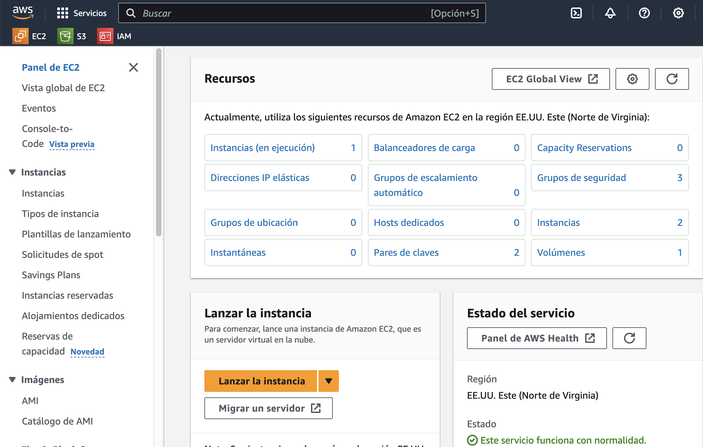

1. **Desplegamos una instancia con las siguientes características:**

- AMI: `Amazon Linux 2023`
  - ID: `ami-0ebfd941bbafe70c6`
- Instance Type: `t2.micro`
  - Family: `t2`
  - vCPU: `1`
  - RAM: `1 GiB`
- Key Pair: `vockey`

2. **Almacenamiento:**

- Volume: `8 GiB`
- Type: `gp3`

3. **Configuración de la Red y del Grupo de Seguridad:**

- VPC: `default`
- Subnet: `default`
- Public IP: `Auto-assign public IP`
- Security Group:
  - Name: `SSH_gate`
  - Description: `Security group for SSH_gate`
  - Inbound Rules:
    - Type: `SSH`
      - Port Range: `22`
      - Source: `0.0.0.0/0` (Anywhere)

4. **Lanzamos la instancia y esperamos a que esté disponible**

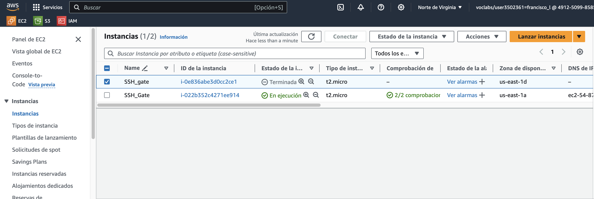

5. **Accedemos a la instancia `SSH_gate` por SSH**

Nos hace falta:

- Un cliente SSH
- La clave privada: `vockey.pem`
  - En linux/macOS: `chmod 400 vockey.pem`
- El usuario: `ec2-user`
- La dirección IP pública de la instancia: `ec2-54-87-55-252.compute-1.amazonaws.com`

```bash
ssh -i "~/.ssh/vockey.pem" ec2-user@ec2-54-87-55-252.compute-1.amazonaws.com
```

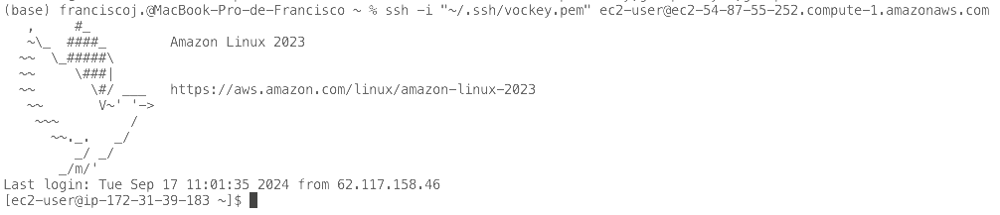

### 2. Despliegue una instancia en EC2 que tenga una servidor web en la que muestre su nombre y su afición favorita. Esta maquina solo podrá ser accedida por SSH desde la maquina que desplegamos anteriormente SSH_gate.

Hay muchas formas de montar un servidor web, pero aquí tienen un script simple que 
deberán modificar y os podría servir de punto de inicio:

```bash
#!/bin/bash
yum update -y
yum -y install httpd
systemctl enable httpd
systemctl start httpd
echo '<html><h1>&#925&#927 &#924&#917 h&#917 l&#917&#921d&#927 l&#913 
&#929r&#913ct&#921c&#913</h1></html>' > /var/www/html/index.html
```

#### 1. **Desplegamos una  nueva instancia con las siguientes características:**

**Nombre y etiquetas**
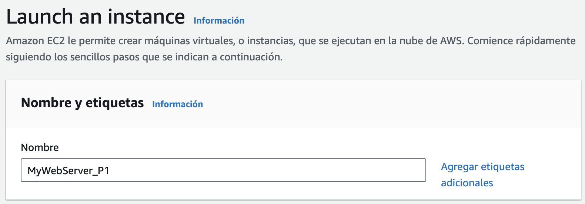

**Imagen**
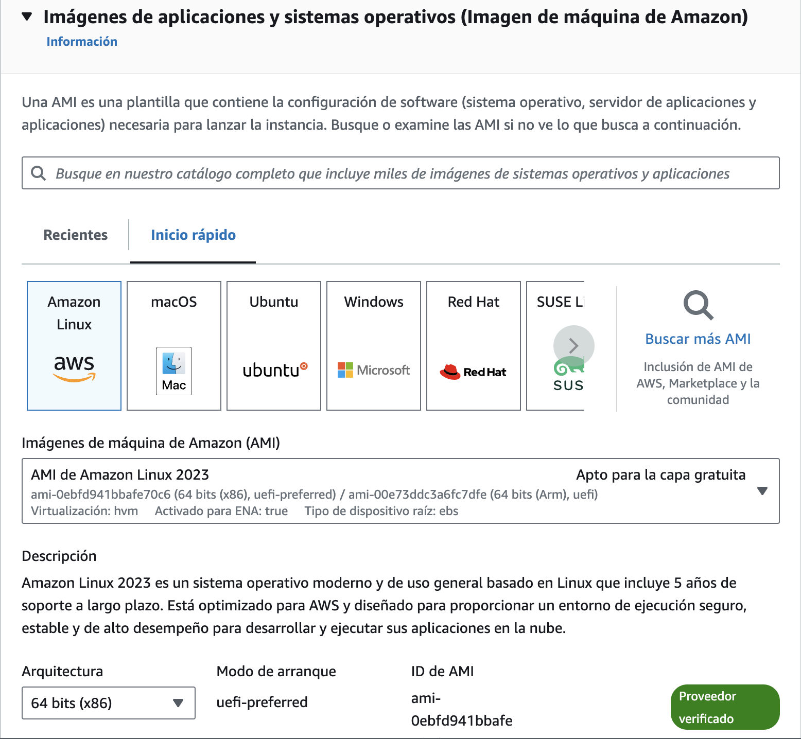

**Tipo de instancia**
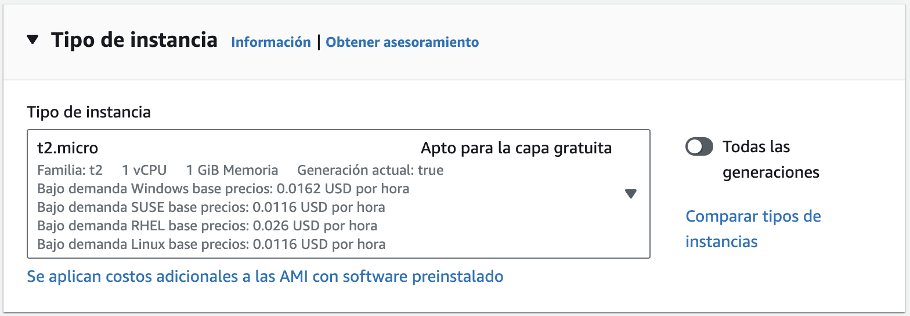

**Par de llaves**
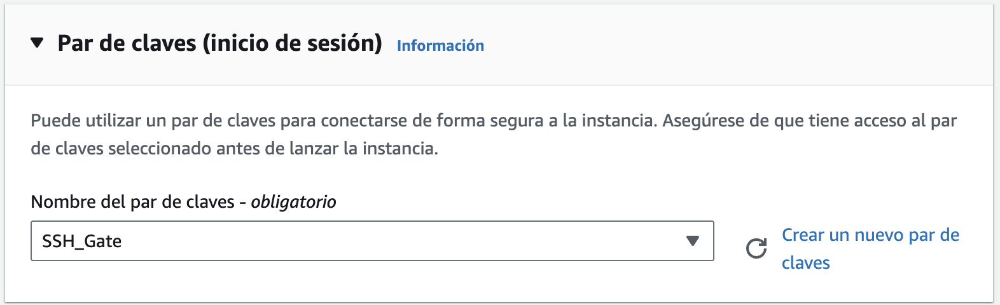 

> **Nota:** He creado una nueva clave en AWS para conectarme a `MyWebServer` a través de `SSH_Gate` y la he seleccionado en "par de llaves".

**Red y subred**

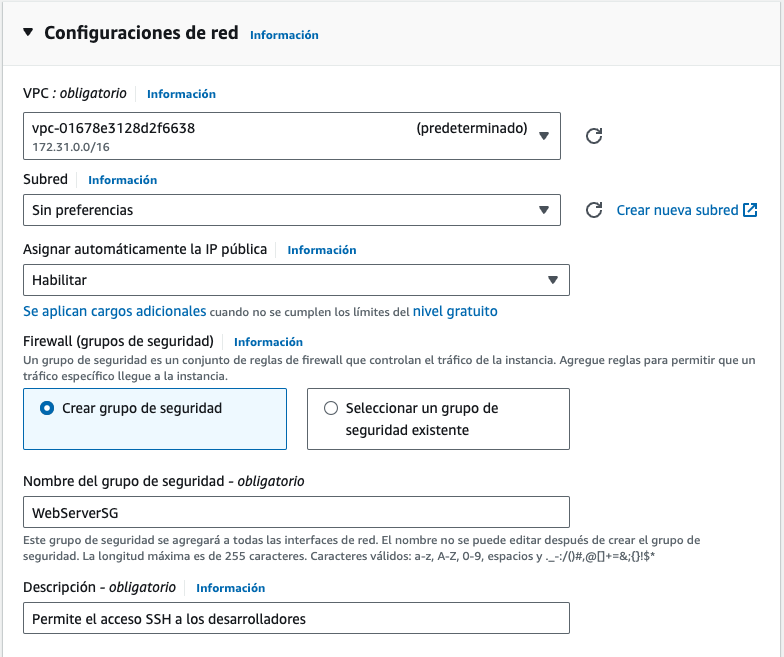
  - VPC: `default`
  - Subnet: `default`
  - Public IP: `Auto-assign public IP`
  
**Grupo de seguridad**

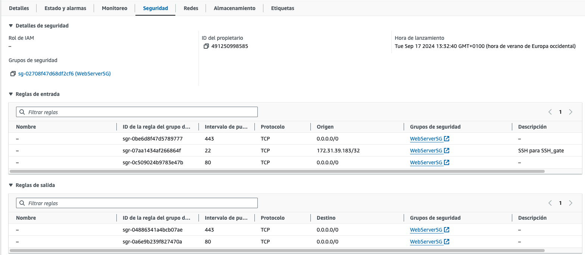

  - Security Group:
    - Name: `MyWebServerSG`
    - Description: `Security group for MyWebServer`
    - Inbound Rules:
      - Type: `SSH`
        - Port Range: `22`
        - Source: `172.31.39.183/32` (SSH_Gate)
      - Type: `HTTP`
        - Port Range: `80`
        - Source: `0.0.0.0/0` (Anywhere)
      - Type: `HTTPS`
        - Port Range: `443`
        - Source: `0.0.0.0/0` (Anywhere)

> **Nota:** Configuramos el Grupo de Seguridad `WebServerSG` para que también permita el tráfico `https`, aunque ahora mismo no sería necesario.

**Almacenamiento**

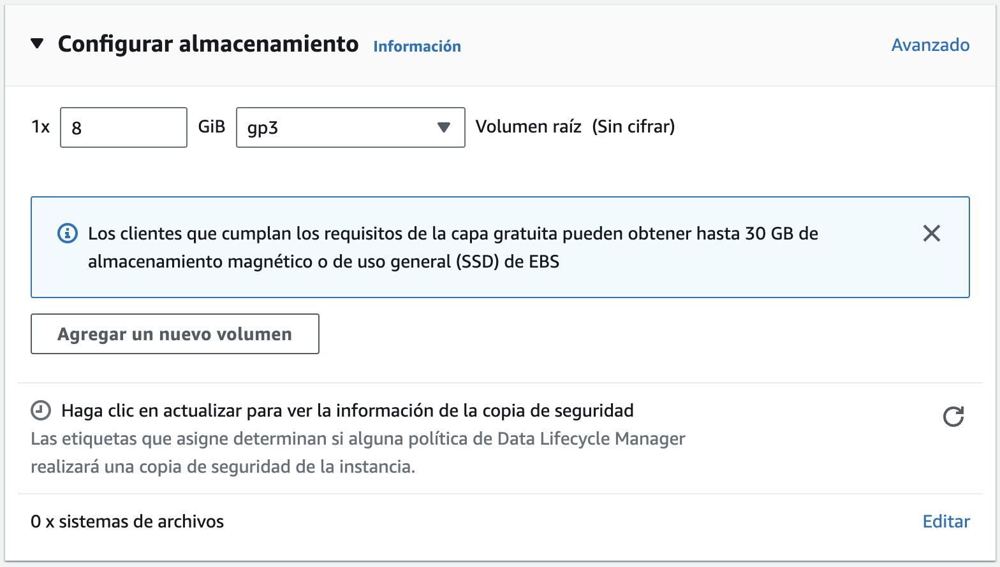

    - Volume: `8 GiB`
    - Type: `gp3`

#### 2. **Lanzamos la instancia y esperamos a que esté disponible**

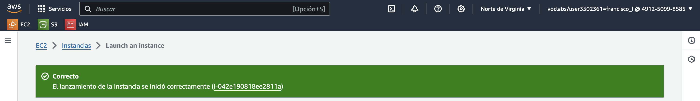

#### 3. **Accedemos a la instancia por SSH**

**3.1 Nos conectamos a la instancia SSH_gate**

```bash
ssh -i "~/.ssh/vockey.pem" ec2-user@ec2-54-87-55-252.compute-1.amazonaws.com
```

**3.2 Configuramos la clave privada de la nueva instancia**

```bash
chmod 400 "~/.ssh/SSH_Gate.pem"
```

**3.3 Desde la instancia SSH_gate nos conectamos por SSH a la nueva instancia `MyWebServer_P1`**

```bash
[ec2-user@ip-172-31-39-183 .ssh]$ ssh -i "~/.ssh/SSH_Gate.pem" ec2-user@ec2-18-206-188-39.compute-1.amazonaws.com
   ,     #_
   ~\_  ####_        Amazon Linux 2023
  ~~  \_#####\
  ~~     \###|
  ~~       \#/ ___   https://aws.amazon.com/linux/amazon-linux-2023
   ~~       V~' '->
    ~~~         /
      ~~._.   _/
         _/ _/
       _/m/'
[ec2-user@ip-172-31-38-62 ~]$ 
```

**Ejecutamos el script de configuración del servidor web**

```bash
chmod +x setup-web-server.sh 
./setup-web-server.sh 
```

**3.4 Comprobamos que el servidor web está funcionando**

* IP pública de la instancia: `18.206.188.39`

```bash
(base) franciscoj ~ % curl http://18.206.188.39:80
```

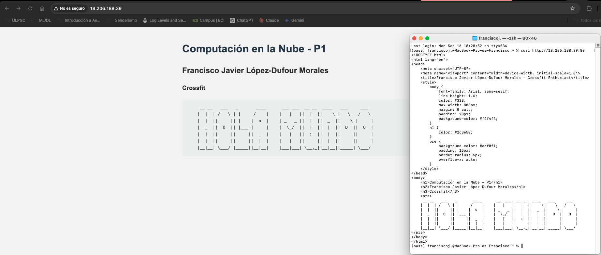
 
### 3. Actividades extras (2 puntos): El alumno podrá proponer una actividad extra a negociar con  el profesor. Sera evaluada del mismo modo que las anteriores (defensa con el profesor y descripción en la memoria). Estas actividades deberán estar en la linea de la practica pero demostrar esfuerzo y conocimientos mas allá de lo básico.

#### Análisis de Costos de las Instancias EC2

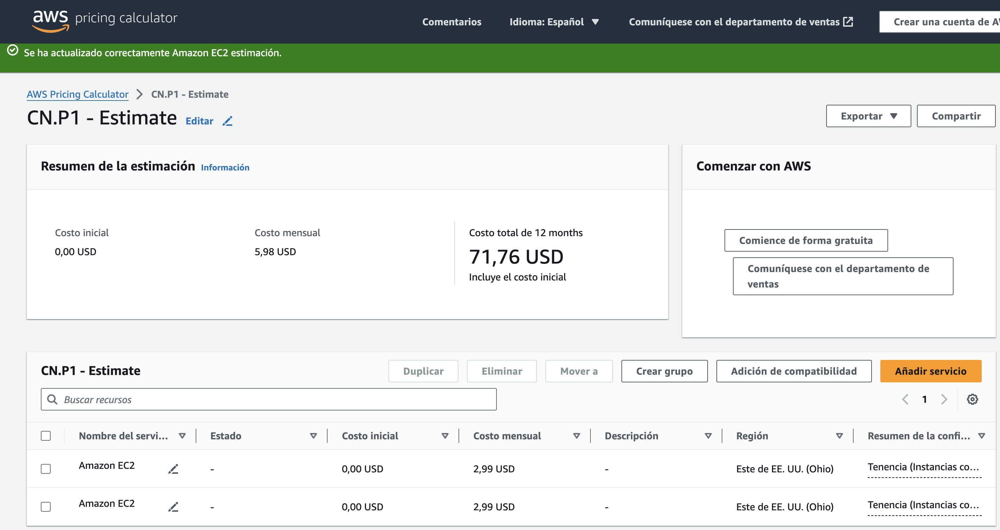

**Resumen de la Estimación**

- Instancia EC2: SSH_gate
  - Costo inicial: 0,00 USD
  - Costo mensual: 2,99 USD
- Instancia EC2: MyWebServer
  - Costo inicial: 0,00 USD
  - Costo mensual: 2,99 USD

El costo mensual total para mantener ambas instancias EC2 es de 5,98 USD, lo que se traduce en un costo anual de 71,76 USD. 

> **Nota:** El costo de las instancias EC2 es bastante razonable para un entorno de práctica y aprendizaje en la nube, especialmente considerando que ambas instancias están configuradas con características básicas (t2.micro) y almacenamiento estándar (gp3).
