# Práctica 2 - Base de datos, balanceo y escalado

Asignatura: Computación en la Nube 

Autor: Francisco Javier López-Dufour Morales

## Índice

- [Práctica 2 - Base de datos, balanceo y escalado](#práctica-2---base-de-datos-balanceo-y-escalado)
  - [Índice](#índice)
  - [1. Introducción](#1-introducción)
  - [2. Objetivos](#2-objetivos)
  - [3. Actividades](#3-actividades)
    - [3.1. Despliegue y configuración de las instancias EC2](#31-despliegue-y-configuración-de-las-instancias-ec2)
    - [3.2. Despliegue de un "load balancer"](#32-despliegue-de-un-load-balancer)
    - [3.3. Despliegue de un "auto scaling group"](#33-despliegue-de-un-auto-scaling-group)
    - [3.4. Despliegue de una base de datos "relacional"](#34-despliegue-de-una-base-de-datos-relacional)
    - [3.5. Diagrama de la infraestructura desplegada](#35-diagrama-de-la-infraestructura-desplegada)
    - [3.6. Presupuesto y estimación de gasto de los recursos desplegados](#36-presupuesto-y-estimación-de-gasto-de-los-recursos-desplegados)
  - [4. Conclusiones](#4-conclusiones)
  - [5. Bibliografía](#5-bibliografía)
  - [6. Anexos](#6-anexos)

## 1. Introducción

El objetivo de esta práctica es explorar y experimentar con las herramientas de balanceo de carga y escalado proporcionadas por AWS, aplicando los conceptos teóricos aprendidos en clase para desplegar una infraestructura web escalable y altamente disponible.

## 2. Objetivos

- Desplegar y configurar instancias EC2 que funcionen como servidores web independientes.
- Implementar un balanceador de carga que distribuya el tráfico de manera equitativa entre las instancias.
- Configurar un grupo de autoescalado para mantener la disponibilidad y ajustar la capacidad según la demanda. 
- Desplegar una base de datos relacional utilizando Amazon RDS.
- Realizar un diagrama de la infraestructura y estimar los costos asociados a los recursos utilizados.

## 3. Actividades

### 3.1. Despliegue y configuración de las instancias EC2

> **Requisito**: Despliega dos instancia en EC2 con un servidor web que muestre una pagina similar pero que se pueda reconocer que es un servidor distinto. Estos servidores deben poder ser accedidos con un navegador desde fuera.

Configuración de las instancias EC2:

* AMI seleccionada
  * Amazon Linux 2023 AMI 2023.5.2 (`ami-0ebfd941bbafe70c6`)
* Tipo de instancia
  * `t2.nano` (seleccionada por su equilibrio entre costo y rendimiento para pruebas)
* Grupo de seguridad:
  * `SG-SSH-HTTP-HTTPS` (configurado para permitir tráfico SSH, HTTP y HTTPS)

Configuración del grupo de seguridad:

| Nombre | ID de la regla del grupo de seguridad | Versión de IP | Tipo               | Protocolo | Intervalo de puertos | Origen        | Descripción |
|--------|---------------------------------------|---------------|--------------------|-----------|----------------------|---------------|-------------|
|        | sgr-07861fea6d1e6cb9e                | IPv4         | HTTPS              | TCP       | 443                  | 0.0.0.0/0     |             |
|        | sgr-002bcf0775e6ab4ee                | IPv4         | SSH                | TCP       | 22                   | 0.0.0.0/0     |             |
|        | sgr-0a8dce6066c4ab592                | IPv4         | TCP personalizado  | TCP       | 0                    | 0.0.0.0/0     |             |
|        | sgr-048cf1efa02df6e89                | IPv4         | HTTP               | TCP       | 80                   | 0.0.0.0/0     |             |

Instancias EC2 ejecutándose:

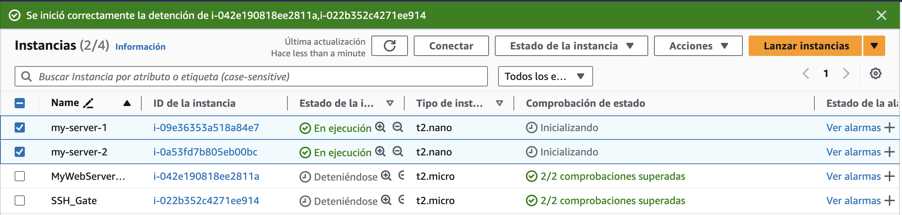

Pasos realizados

1. **Conexión a las instancias**: Utilizamos SSH para conectarnos a cada instancia EC2.
2. **Ejecución del script de configuración**: Subimos y ejecutamos el script `setup_server.sh` que automatiza la instalación de Node.js, configuración del servidor Express y Nginx como proxy inverso.

```
chmod +x setup_server.sh
sudo ./setup_server.sh
```

3. **Verificación del servidor web**: Accedemos a la IP pública de cada instancia desde un navegador para comprobar que el servidor web está operativo y muestra el hostname, permitiendo distinguir entre ambos servidores.

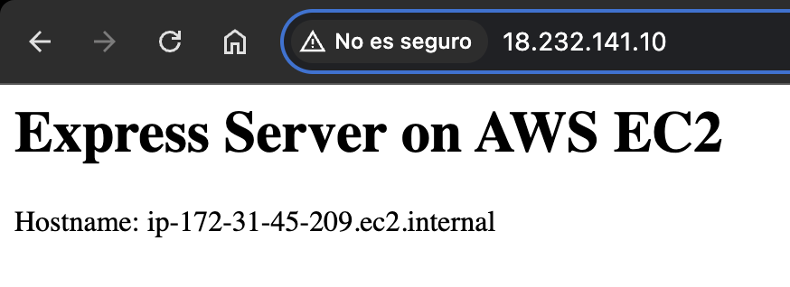
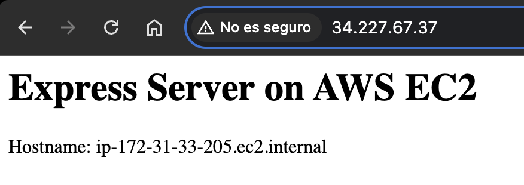

### 3.2. Despliegue de un "load balancer" 

> **Requisito**: Despliega un “load balancer” que distribuya las peticiones entre los dos servidores a partes iguales.

Antes de nada, es necesario crear un grupo de destino (target group) para los servidores web.

Desde el menu de EC2, accedemos a "Grupos de destino".

Pasos realizados:

1. Creación del grupo de destino (**Target Group**)**:
     * Tipo de destino: Instancias
     * Nombre: `lb-pr2-p2-tg`
     * Protocolo: HTTP (Puerto 80)
     * Configuración de comprobación de estado: Ruta /

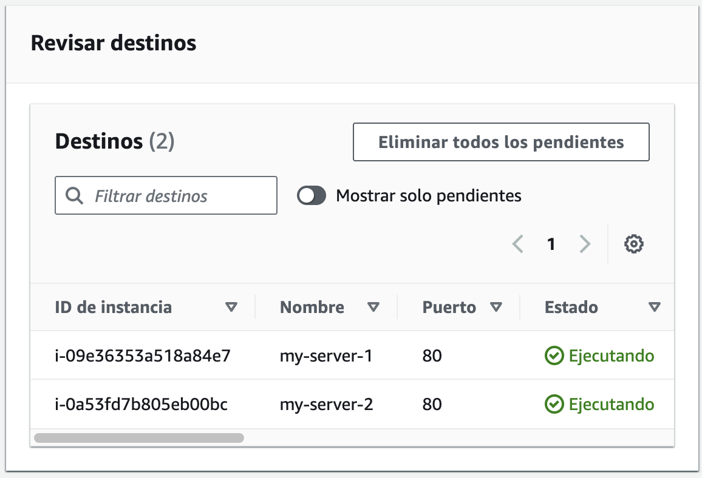
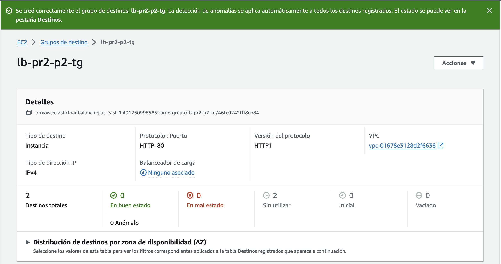

2. Creación del **balanceador de carga** de aplicaciones (ALB):
    * Nombre: `lb-pr2-p2`
    * Esquema: Expuesto a Internet
    * Subredes: `us-east-1a`, `us-east-1b`
    * Grupos de seguridad: `SG-SSH-HTTP-HTTPS`
    * Configuración de listeners: Protocolo HTTP en el puerto 80, encaminado al grupo de destino `lb-pr2-p2-tg`

Resumen

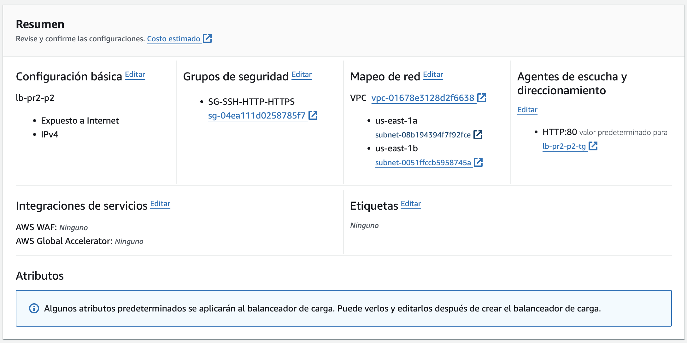
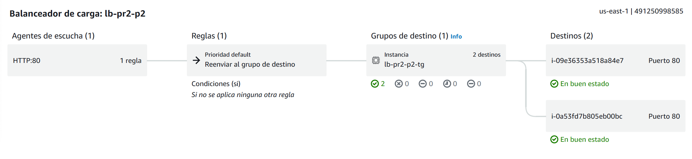

**Verificación**

Utilizamos `curl` para enviar peticiones al DNS del balanceador de carga y observamos que las respuestas provienen de ambas instancias, confirmando la distribución equitativa del tráfico.

```
lb-pr2-p2-1198883516.us-east-1.elb.amazonaws.com
```

Comprobamos que el balanceador de carga distribuye las peticiones entre los servidores web.

```bash
(base) fran.@MacBook ~ % curl lb-pr2-p2-1198883516.us-east-1.elb.amazonaws.com
<h1>Express Server on AWS EC2</h1><p>Hostname: ip-172-31-45-209.ec2.internal</p>%               

(base) fran.@MacBook ~ % curl lb-pr2-p2-1198883516.us-east-1.elb.amazonaws.com
<h1>Express Server on AWS EC2</h1><p>Hostname: ip-172-31-33-205.ec2.internal</p>%                                                   
```

### 3.3. Despliegue de un "auto scaling group"

> **Requisito**: Configurar un Auto Scaling Group (ASG) con un mínimo de 1 instancia y un máximo de 2, utilizando un template de instancia.

Para crear un Auto Scaling Group (ASG) necesitamos un Launch Template.

Desde el menu de EC2, accedemos a EC2 > ... > "Crear plantilla de lanzamiento".

1. Crear un nuevo **Launch Template**:

  * Nombre: `lt-pr2-p2`
  * Descripción: Launch template for EC2 instances
  * Versión: 1
  * Tipo de instancia: `t2.nano`
  * AMI: `Amazon Linux 2023 AMI 2023.5.2`
  * Tipo de almacenamiento: `EBS`
  * Tamaño de almacenamiento: `8 GiB`
  * Grupo de seguridad: `SG-SSH-HTTP-HTTPS`
  * Clave de par: 
  * Tipo de red: `default`
  * Datos de usuario: `setup_server.sh` (script de configuración de la instancia)

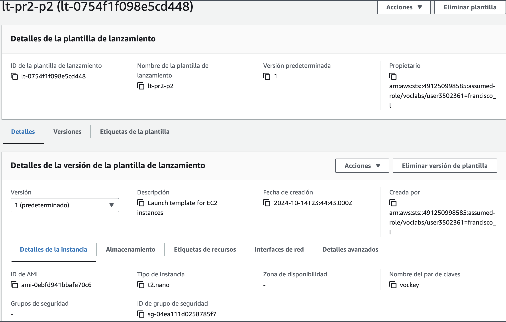

2. Una vez creado el Launch Template, creamos un **Auto Scaling Group**.

  * Nombre: `asg-pr2-p2`
  * Plantilla de lanzamiento: `lt-pr2-p2`
  * Configuración de grupo:
    * Capacidad deseada: 1 instancia
    * Capacidad mínima: 1 instancia
    * Capacidad máxima: 2 instancias
    * Redes: `default`
    * Subredes: `us-east-1a`, `us-east-1b`
    * Grupo de destino: `lb-pr2-p2-tg`
    * Grupo de equilibrador de carga: `lb-pr2-p2`
    * Configuración de escalado:
      * Escalado de destino:
        * Grupo de destino: `lb-pr2-p2-tg` (integración con el balanceador de carga)
    * Política de mantenimiento de instancias:
      * Comporamiento mixto: Sin política. 

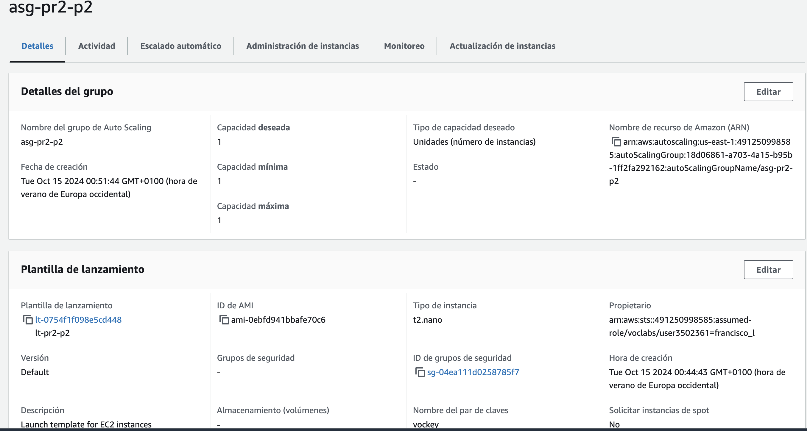
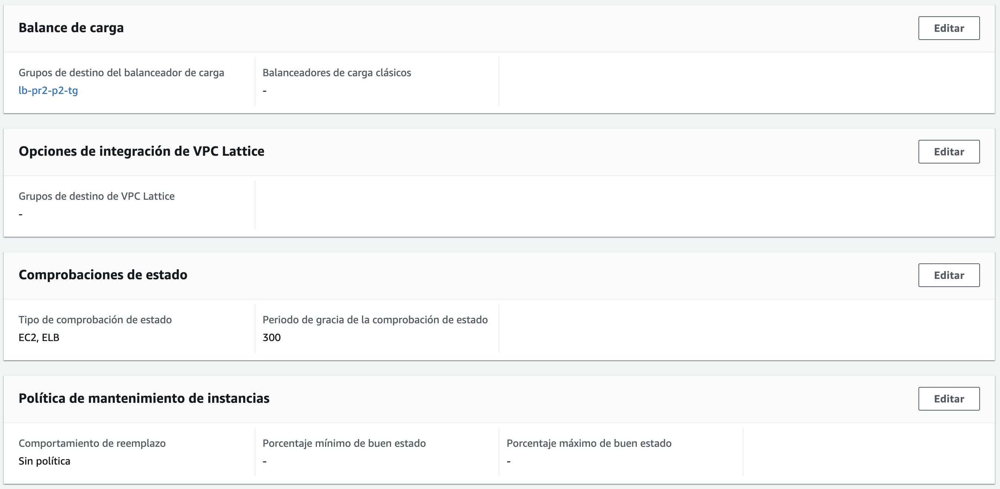

Una vez creado el Auto Scaling Group, detenemos todas las instancias y comprobamos que mantiene al menos una instancia viva de forma automática.

```bash
(base) franciscoj.@MacBook ~ % curl lb-pr2-p2-1198883516.us-east-1.elb.amazonaws.com
<!DOCTYPE html>
<html lang="en">
<head>
    <meta charset="UTF-8">
    <meta name="viewport" content="width=device-width, initial-scale=1.0">
    <title>Francisco Javier López-Dufour Morales
```

Y comprobamos el estado del Load Balancer.

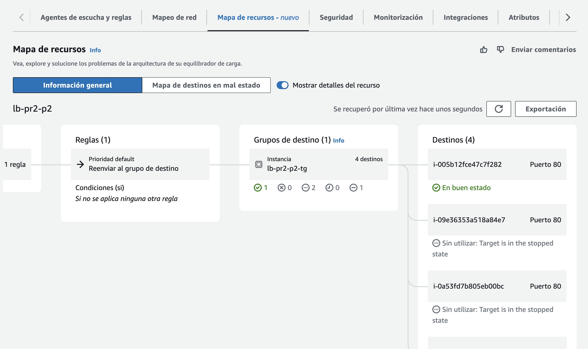

### 3.4. Despliegue de una base de datos "relacional"

> **Requisito**: Desplegar una base de datos de elección dentro de AWS, demostrar su funcionamiento y estimar el costo de utilización.

AWS ofrece varios servicios de bases de datos relacionales mediante Amazon RDS (Relational Database Service).

En este caso, vamos a desplegar una base de datos MySQL.

Desde el menu de RDS, accedemos a "Bases de datos" y creamos una nueva base de datos.

Pasos realizados:

1. Creación de una instancia de base de datos en Amazon RDS:

* Motor: MySQL (versión 8.0.25)
* Tipo de instancia: `db.t4g.micro` (dentro del Free Tier)
* Almacenamiento: `20 GiB SSD`
* Configuración de credenciales: Usuario admin y una contraseña segura.

2. Configuración de seguridad:

* Modificamos el grupo de seguridad para permitir conexiones desde las instancias EC2 y nuestra IP local para administración.

3. Verificación:

* Conectamos a la base de datos desde nuestra máquina local utilizando el cliente MySQL:


```bash
mysql -h pr2-p2-db.cntejlvl3d16.us-east-1.rds.amazonaws.com -u admin -p
Enter password: 
Welcome to the MySQL monitor.  Commands end with ; or \g.
Your MySQL connection id is 28
Server version: 8.0.35 Source distribution

Copyright (c) 2000, 2018, Oracle and/or its affiliates. All rights reserved.

Oracle is a registered trademark of Oracle Corporation and/or its
affiliates. Other names may be trademarks of their respective
owners.

Type 'help;' or '\h' for help. Type '\c' to clear the current input statement.
```

Resumen:

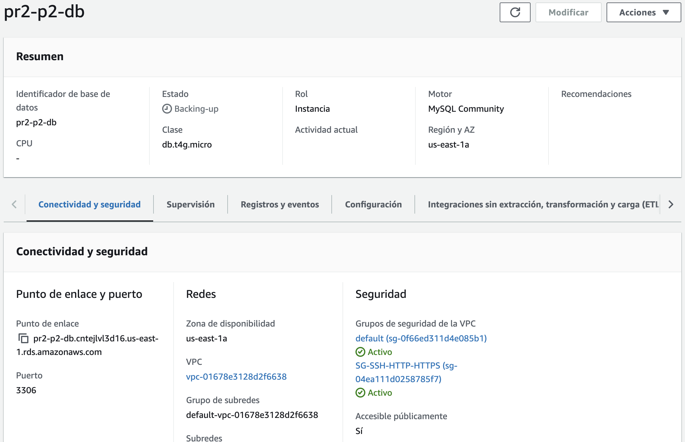


Coste de utilización:

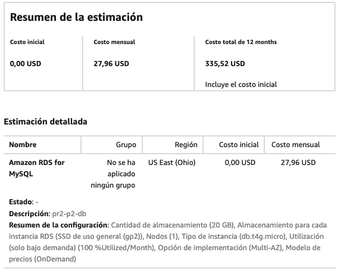

* Costo mensual: $27.96.
* Costo anual: $335.52.

### 3.5. Diagrama de la infraestructura desplegada

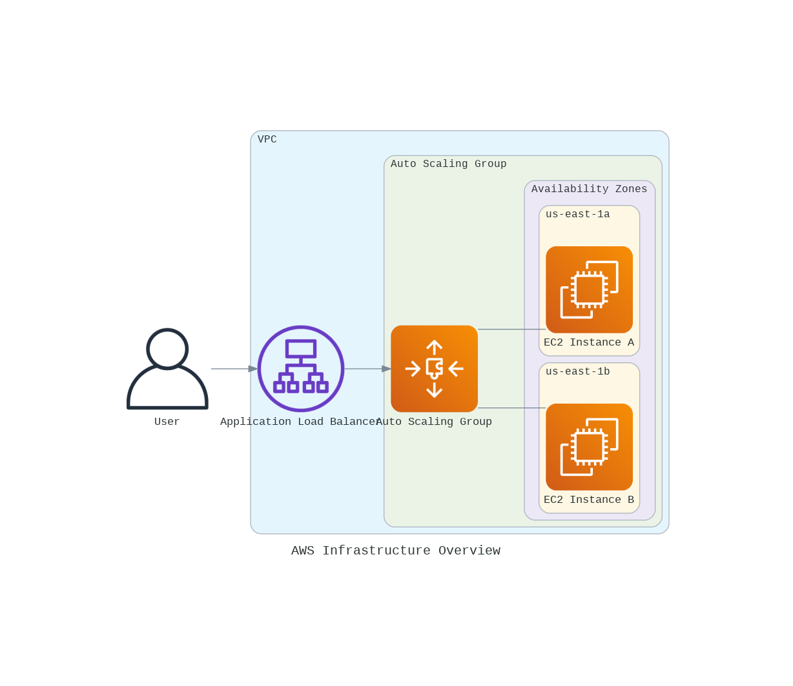

### 3.6. Presupuesto y estimación de gasto de los recursos desplegados

El costo mensual estimado de los recursos desplegados es el siguiente:

* **Instancias EC2**:

  * 2 instancias `t2.nano` en la región Norte de Virginia (`us-east-1`).
  * Costo mensual estimado: $4.23.
  * Costo anual estimado: $50.81.

* **Auto Scaling Group (ASG)**:
  * 1 grupo de autoescalado en la región Norte de Virginia (`us-east-1`).
  * Costo mensual estimado: $0.00.
  * Costo anual estimado: $0.00.

* **Application Load Balancer (ALB)**:
  * 1 balanceador de carga en la región Norte de Virginia (`us-east-1`).
  * Costo mensual estimado: $60.23.
  * Costo anual estimado: $722.76.

Costo total mensual estimado: $64.46.
Costo total anual estimado: $773.52.

_Nota_: Esta estimación es un cálculo preliminar basado en el uso constante de los recursos mencionados. El costo real puede variar en función del uso real, la configuración regional y otros factores. Además, no se incluyen los impuestos aplicables.

## 4. Conclusiones

En esta práctica, hemos logrado desplegar una infraestructura web escalable y altamente disponible utilizando los servicios de AWS. La experiencia nos permitió comprender cómo integrar diferentes componentes como EC2, balanceadores de carga, grupos de autoescalado y bases de datos relacionales para construir soluciones robustas en la nube.

## 5. Bibliografía

- [Amazon EC2](https://aws.amazon.com/ec2/)
- [Amazon RDS](https://aws.amazon.com/rds/)
- [Amazon Web Services In Action](https://www.manning.com/books/amazon-web-services-in-action-second-edition)

## 6. Anexos

```setup_server.sh
#!/bin/bash

# Update the system
sudo yum update -y

# Install Node Version Manager (nvm)
curl -o- https://raw.githubusercontent.com/nvm-sh/nvm/v0.39.3/install.sh | bash

# Load nvm
export NVM_DIR="$HOME/.nvm"
[ -s "$NVM_DIR/nvm.sh" ] && \. "$NVM_DIR/nvm.sh"

# Install Node.js
nvm install 16

# Create a new directory for the application
mkdir ~/myapp
cd ~/myapp

# Initialize a new Node.js project and install Express
npm init -y
npm install express

# Create a simple Express server
cat << EOF > app.js
const express = require('express');
const app = express();
const port = 3000;

app.get('/', (req, res) => {
  res.send('<h1>Express Server on AWS EC2</h1><p>Hostname: ' + require('os').hostname() + '</p>');
});

app.listen(port, () => {
  console.log(\`Server running at http://localhost:\${port}\`);
});
EOF

# Install PM2 globally
npm install pm2 -g

# Start the Express server with PM2
pm2 start app.js

# Configure PM2 to start on system boot
pm2 startup
pm2 save

# Install and configure nginx as a reverse proxy
sudo yum install nginx

# Configure nginx
sudo tee /etc/nginx/conf.d/myapp.conf > /dev/null <<EOF
server {
    listen 80;
    server_name _;

    location / {
        proxy_pass http://127.0.0.1:3000;
        proxy_http_version 1.1;
        proxy_set_header Upgrade \$http_upgrade;
        proxy_set_header Connection 'upgrade';
        proxy_set_header Host \$host;
        proxy_cache_bypass \$http_upgrade;
    }
}
EOF

# Remove the default nginx configuration
sudo rm /etc/nginx/conf.d/default.conf

# Start and enable nginx
sudo systemctl start nginx
sudo systemctl enable nginx

# Print the public IP address
echo "Setup complete. Your server's public IP address is:"
curl -s http://169.254.169.254/latest/meta-data/public-ipv4

echo "You can access your Express server by visiting this IP address in your web browser."
```
