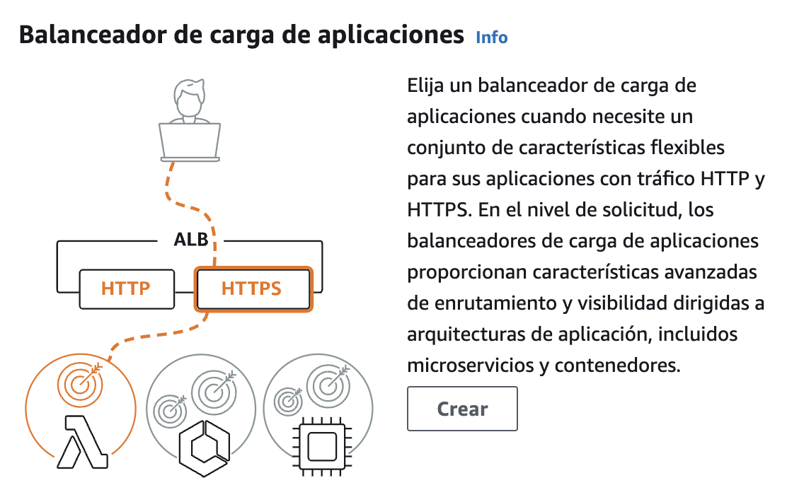

# Computación en la Nube

## Práctica 2 - Base de datos, balanceo y escalado

Author: Francisco Javier López-Dufour Morales

### 1. Introducción

El objetivo de esta práctica es explorar y experimentar con las herramientas de balanceo de carga y escalado explicadas en la clase teórica.

### 2. Objetivos

### 3. Actividades

### 3.1. Despliegue y configuración de las instancias EC2

> Despliega dos instancia en EC2 con un servidor web que muestre una pagina similar pero que se pueda reconocer que es un servidor distinto. E.g. [El servidor de Gabriel 1] [Elservidor de Gabriel 2]. Estos servidores deben poder ser accedidos con un navegador desde fuera.

Lanzamos dos instancias EC2 con las siguientes características:

```
Imagen de software (AMI)
- Amazon Linux 2023 AMI 2023.5.2...más información
- ami-0ebfd941bbafe70c6
Tipo de servidor virtual (tipo de instancia)
- t2.nano
Firewall (grupo de seguridad)
- SG-SSH-HTTP-HTTPS
Almacenamiento (volúmenes)
- Volúmenes: 1 (8 GiB)
```

Configuración del grupo de seguridad:

| Nombre | ID de la regla del grupo de seguridad | Versión de IP | Tipo               | Protocolo | Intervalo de puertos | Origen        | Descripción |
|--------|---------------------------------------|---------------|--------------------|-----------|----------------------|---------------|-------------|
|        | sgr-07861fea6d1e6cb9e                | IPv4         | HTTPS              | TCP       | 443                  | 0.0.0.0/0     |             |
|        | sgr-002bcf0775e6ab4ee                | IPv4         | SSH                | TCP       | 22                   | 0.0.0.0/0     |             |
|        | sgr-0a8dce6066c4ab592                | IPv4         | TCP personalizado  | TCP       | 0                    | 0.0.0.0/0     |             |
|        | sgr-048cf1efa02df6e89                | IPv4         | HTTP               | TCP       | 80                   | 0.0.0.0/0     |             |

Instancias EC2 ejecutándose:


Configuración de los servidores web:

1. Conectamos a las instancias EC2 mediante SSH.
2. Subimos y ejecutamos el script de setup_server.sh:

```
chmod +x setup_server.sh
sudo ./setup_server.sh
```

3. Comprobamos que el servidor web se ejecuta correctamente accediendo a la IP pública de la instancia EC2 desde un navegador.


### 3.2. Despliegue de un "load balancer" 

> Despliega un “load balancer” que distribuya las peticiones entre los dos servidores a partes iguales.

Antes de nada, es necesario crear un grupo de destino (target group) para los servidores web.

Desde el menu de EC2, accedemos a "Grupos de destino".

* Configuración básica:

  * Tipo de destino: Instancias de EC2
  * Nombre del grupo de destino: lb-pr2-p2-tg
  * Protocolo: HTTP
    * Puerto: 80
  * Tipo de dirección IP: IPv4
  * VPC: default
  * Versión del protocolo: HTTP1

* Comprobaciones de estado
  * Protocolo de comprobación de estado: HTTP
  * Ruta: /
  * Configuración avanzada: default

* Registrar destinos:


A continuación, creamos el **balanceador de carga**.

Desde el menu de EC2, accedemos a "Balanceadores de carga".

A la hora de crear un balanceador de carga, AWS nos permite elegir entre varios tipos de balanceadores de carga:

* Balanceador de carga de aplicaciones
* Balanceador de carga de red
* Equilibrador de carga de gateway

En nuestro caso, como queremos balancear el tráfico HTTP, usaremos un balanceador de carga de aplicaciones.



En la pestaña "Configure subnet settings" seleccionamos las subredes a las que se conectará el balanceador de carga.

Configuración:

* Configuración básica:
  * Nombre: lb-pr2-p2
  * Esquema: Expuesto a Internet
  * Tipo de direcciones IP: IPv4
* Mapa de red:
  * VPC: default
  * Zonas de disponibilidad: us-east-1a, us-east-1b
* Grupos de seguridad: SG-SSH-HTTP-HTTPS
* Agentes de escucha y direccionamiento:
  * Protocolo: HTTP
  * Puerto: 80
  * Grupo de destino: lb-pr2-p2-tg

Resumen


========= WORK IN PROGRESS =========


### 3.3. Despliegue de un "auto scaling group"

> Prepara un “template” de instancia para EC2 para generar servidores web. Con el “template” declarar un “Auto-Scaling Group”(ASG) que tenga como mínimo una instancia y como máximo 2. El ASG debe añadirse al “load balancer” previamente desplegado. Comprueba que el ASG mantiene al menos una instancia viva y que el “load balancer” le manda peticiones entrantes.

### 3.4. Despliegue de una base de datos "relacional"

> Investigar y desplegar una base de datos de su elección dentro de AWS. Demostrar que funcione y estimar el coste de utilización.

#### 3.X. Diagrama de la infraestructura desplegada

#### 3.X. Presupuesto y estimación de gasto de los recursos desplegados

### 4. Conclusiones
