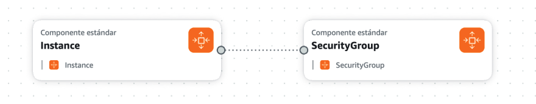
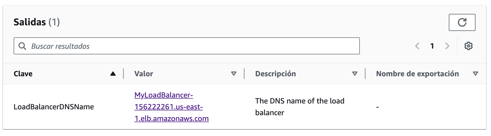
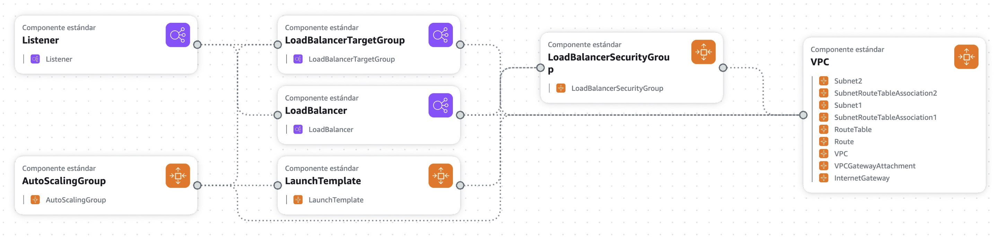
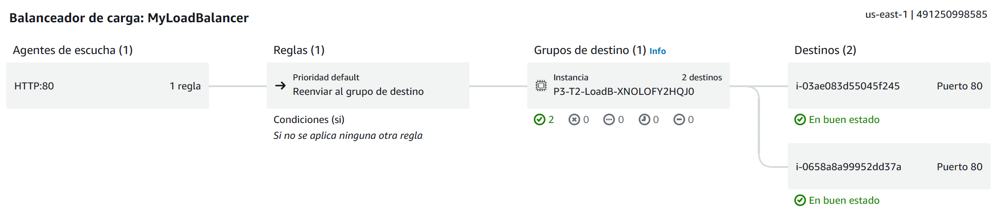

# Práctica 3 - CloudFormation para Arquitectura en la Nube

**Asignatura**: Computación en la Nube

**Fecha**: 04/11/2024

**Autor**: Francisco Javier López-Dufour Morales

<br>
<br> 
<br>
<br>
<br>


<div class="page"/>

## Índice

- [Práctica 3 - CloudFormation para Arquitectura en la Nube](#práctica-3---cloudformation-para-arquitectura-en-la-nube)
  - [Índice](#índice)
  - [1. Introducción](#1-introducción)
  - [2. Objetivos](#2-objetivos)
  - [3. Descripción de Actividades](#3-descripción-de-actividades)
    - [3.1. Stack de CloudFormation con EC2 y SSH](#31-stack-de-cloudformation-con-ec2-y-ssh)
    - [3.2. Stack de CloudFormation con EC2, Load Balancer y ASG](#32-stack-de-cloudformation-con-ec2-load-balancer-y-asg)
  - [4. Diagrama de la Arquitectura Desplegada](#4-diagrama-de-la-arquitectura-desplegada)
  - [5. Presupuesto y Estimación de Costos](#5-presupuesto-y-estimación-de-costos)
  - [6. Conclusiones](#6-conclusiones)
  - [7. Referencias](#7-referencias)

<div class="page"/>

## 1. Introducción

El propósito de esta práctica es utilizar AWS CloudFormation para desplegar y gestionar arquitecturas en la nube de forma automatizada, repitiendo las configuraciones realizadas en las prácticas anteriores pero definiéndolas como plantillas en JSON/YAML.

AWS CloudFormation es un servicio que permite definir y desplegar arquitecturas de nube de forma automatizada. Utilizando plantillas en formato JSON o YAML, es posible describir la infraestructura y los recursos necesarios para desplegar una aplicación en AWS. Esto facilita la creación, actualización y eliminación de recursos de forma consistente y reproducible.

<div class="page"/>

## 2. Objetivos

- Aprender a definir y desplegar arquitecturas de nube con AWS CloudFormation.
- Utilizar JSON/YAML para describir stacks de infraestructura, incluyendo instancias EC2, balanceadores de carga y grupos de autoescalado (ASG).
- Implementar prácticas de seguridad con grupos de seguridad y claves de acceso adecuadas.
- Estimar los costos asociados a la infraestructura desplegada en AWS.

<div class="page"/>

## 3. Descripción de Actividades

### 3.1. Stack de CloudFormation con EC2 y SSH

**Descripción**: Crear un stack en CloudFormation que despliegue una instancia EC2 accesible mediante SSH y un servidor web para mostrar características de la máquina.

**Pasos seguidos**

1.	Definición de la plantilla en CloudFormation:
     - Se optó por utilizar YAML para definir la infraestructura de manera declarativa. 
     - Se especificó el tipo de instancia (`t2.micro`), ideal para pruebas básicas y bajo consumo de recursos, manteniendo costos bajos.
2.	Configuración de Seguridad:
     - Para habilitar el acceso a la instancia mediante SSH y HTTP, se definió un grupo de seguridad que permite el tráfico en los puertos `22` (SSH) y `80` (HTTP) desde cualquier dirección IP (`0.0.0.0/0`). 
     - Se definió la clave de acceso (KeyName: `vockey`) para permitir el acceso seguro a la instancia.
3.	Personalización de la Instancia mediante UserData:
     - En el bloque UserData, se incluyó un script para instalar y configurar Apache (`httpd`) como servidor web. Además, se instaló `uuid` para generar un identificador único en cada despliegue, facilitando la identificación de la instancia.
     - Se creó una página HTML sencilla que muestra el UUID de la instancia en el archivo `/var/www/html/index.html`. Esto permite verificar que la instancia esté en funcionamiento y muestra un identificador único para cada despliegue.
4.	Pruebas de Acceso y Verificación:
    - `SSH`: Una vez desplegada la instancia, se probó la conexión mediante SSH con la clave privada configurada (`vockey.pem`), verificando así el acceso seguro y remoto a la instancia.
    - `HTTP`: Para validar el funcionamiento del servidor web, se utilizó el comando `curl` para acceder a la página HTML desde el navegador. La respuesta mostraba el UUID, confirmando la correcta ejecución del script de inicialización y la accesibilidad HTTP.

**Plantilla CloudFormation en YAML**:

```yaml
AWSTemplateFormatVersion: '2010-09-09'
Resources:
  Instance:
    Type: AWS::EC2::Instance
    Properties:
      ImageId: ami-06b21ccaeff8cd686
      InstanceType: t2.micro
      KeyName: vockey
      AvailabilityZone: us-east-1
      SecurityGroups:
        - !Ref SecurityGroup
      UserData: !Base64 |
        #!/bin/bash
        yum update -y
        yum install -y httpd
        yum install -y uuid
        echo "<h1>Instance ID: $(uuid)</h1>" > /var/www/html/index.html
        systemctl start httpd
        systemctl enable httpd
  SecurityGroup:
    Type: AWS::EC2::SecurityGroup
    Properties:
      GroupDescription: Enable HTTP and SSH access
      SecurityGroupIngress:
        - IpProtocol: tcp
          FromPort: 80
          ToPort: 80
          CidrIp: 0.0.0.0/0
        - IpProtocol: tcp
          FromPort: 22
          ToPort: 22
          CidrIp: 0.0.0.0/0
Outputs:
  InstanceId:
    Value: !Ref Instance
    Description: Instance ID
```

**Diagrama en Infrastructure Composer**:



**Pruebas de Acceso y Verificación**:

* Accesso por SSH a la instancia EC2:

```bash
ssh -i ".ssh/vockey.pem" ec2-user@ec2-44-204-90-151.compute-1.amazonaws.com 
   ,     #_
   ~\_  ####_        Amazon Linux 2023
  ~~  \_#####\
  ~~     \###|
  ~~       \#/ ___   https://aws.amazon.com/linux/amazon-linux-2023
   ~~       V~' '->
    ~~~         /
      ~~._.   _/
         _/ _/
       _/m/'
[ec2-user@ip-172-31-86-151 ~]$ 
```

* Acceso mediante HTTP a la instancia EC2:

```bash
curl http://ec2-44-204-90-151.compute-1.amazonaws.com
<h1>Instance ID: 71b5ba8a-93f0-11ef-a889-12759881e905</h1>
```

<div class="page"/>

### 3.2. Stack de CloudFormation con EC2, Load Balancer y ASG

**Descripción**: Crear un segundo stack en CloudFormation que incluya dos instancias EC2 con un servidor web, balanceador de carga y un grupo de autoescalado (ASG) que gestione las instancias.


**Pasos seguidos**:

1. Creación de la `VPC` y **Configuración de la Red**:

   * Definición de la VPC: Se creó una VPC personalizada con el rango de direcciones IP `10.0.0.0/16`, lo que proporciona un amplio espacio de direcciones IP para los recursos.
   * Habilitación de DNS: Se activaron `EnableDnsSupport` y `EnableDnsHostnames` para permitir la resolución de nombres de dominio dentro de la VPC.
   * Internet Gateway y Asociaciones:
     * Se creó un InternetGateway para permitir que los recursos dentro de la VPC puedan acceder a Internet.
     * Se adjuntó el Internet Gateway a la VPC mediante VPCGatewayAttachment.
   * Tabla de Rutas y Asociaciones:
     * Se definió una `RouteTable` y una `Route` que dirige el tráfico a Internet (`0.0.0.0/0`) a través del `Internet Gateway`.
     * Se crearon dos subredes públicas (`Subnet1` y `Subnet`2`) en diferentes zonas de disponibilidad para alta disponibilidad.
     * Se asociaron las subredes a la tabla de rutas mediante `SubnetRouteTableAssociation`, permitiendo que el tráfico fluya correctamente.

2. Configuración de **Grupos de Seguridad**:

   * Se creó un `LoadBalancerSecurityGroup` que permite el tráfico entrante en los puertos `80` (HTTP) y `22` (SSH) desde cualquier dirección IP (`0.0.0.0/0`).
   * Este grupo de seguridad se utilizará tanto para el balanceador de carga como para las instancias EC2, aunque es recomendable separar los grupos de seguridad para mejorar la seguridad.

3. Implementación del Balanceador de Carga:

  * Se definió un LoadBalancer de tipo `internet-facing` para distribuir el tráfico entrante entre las instancias EC2.
  * El balanceador de carga se desplegó en ambas subredes públicas para garantizar la alta disponibilidad.
  * Se creó un `LoadBalancerTargetGroup` que contiene las instancias EC2 y define los parámetros de chequeo de salud para garantizar que sólo las instancias saludables reciban tráfico.
  * Se configuró un `Listener` en el puerto `80` que reenvía el tráfico al Target Group.

4. Configuración de las **Instancias EC2** y **Auto Scaling**:

  * Se utilizó un `LaunchTemplate` para definir cómo se lanzarán las instancias EC2.
  * Parámetros del LaunchTemplate:
    * `ImageId`: `ami-06b21ccaeff8cd686`, una AMI específica.
    * `InstanceType`: `t2.micro`, adecuado para cargas de trabajo ligeras y pruebas.
    * `KeyName`: `vockey`, para acceder a las instancias vía SSH.
    * `SecurityGroupIds`: Asociado al `LoadBalancerSecurityGroup`.
    * `UserData`: Script de inicialización que instala Apache (httpd), uuid, configura una página web básica y habilita el servicio de Apache.

  * Se creó un `AutoScalingGroup` que gestiona el número de instancias EC2 en ejecución.
  * Parámetros del AutoScalingGroup:
    * `MinSize`: 2, asegurando que siempre haya al menos dos instancias en ejecución.
    * `MaxSize`: 3, limitando el número máximo de instancias.
    * `DesiredCapacity`: 2, el número deseado de instancias en funcionamiento.
    * `VPCZoneIdentifier`: Especifica las subredes donde se lanzarán las instancias.
    * `TargetGroupARNs`: Asociado al LoadBalancerTargetGroup para que las instancias formen parte del balanceo de carga.
    * `LaunchTemplate`: Referencia al LaunchTemplate creado.

5. Salida del Nombre DNS del Balanceador de Carga:
	•	Se agregó una salida en el template (Outputs) que proporciona el nombre DNS del balanceador de carga. Esto facilita el acceso a la aplicación web desplegada sin necesidad de buscar manualmente el endpoint.


**Plantilla CloudFormation en YAML**:

```yaml
AWSTemplateFormatVersion: '2010-09-09'
Description: "Template de CloudFormation que incluye dos instancias EC2 con un servidor web, balanceador de carga y un grupo de autoescalado."

Resources:

  # -------------------------------
  # VPC y Recursos de Red
  # -------------------------------

  VPC:
    Type: AWS::EC2::VPC
    Properties:
      CidrBlock: 10.0.0.0/16
      EnableDnsSupport: true
      EnableDnsHostnames: true
      Tags:
        - Key: Name
          Value: MyVPC

  InternetGateway:
    Type: AWS::EC2::InternetGateway

  VPCGatewayAttachment:
    Type: AWS::EC2::VPCGatewayAttachment
    Properties:
      VpcId: !Ref VPC
      InternetGatewayId: !Ref InternetGateway

  RouteTable:
    Type: AWS::EC2::RouteTable
    Properties:
      VpcId: !Ref VPC

  Route:
    Type: AWS::EC2::Route
    Properties:
      RouteTableId: !Ref RouteTable
      DestinationCidrBlock: 0.0.0.0/0
      GatewayId: !Ref InternetGateway

  Subnet1:
    Type: AWS::EC2::Subnet
    Properties:
      VpcId: !Ref VPC
      CidrBlock: 10.0.1.0/24
      MapPublicIpOnLaunch: true
      AvailabilityZone: !Select [0, !GetAZs '']

  Subnet2:
    Type: AWS::EC2::Subnet
    Properties:
      VpcId: !Ref VPC
      CidrBlock: 10.0.2.0/24
      MapPublicIpOnLaunch: true
      AvailabilityZone: !Select [1, !GetAZs '']

  SubnetRouteTableAssociation1:
    Type: AWS::EC2::SubnetRouteTableAssociation
    Properties:
      SubnetId: !Ref Subnet1
      RouteTableId: !Ref RouteTable

  SubnetRouteTableAssociation2:
    Type: AWS::EC2::SubnetRouteTableAssociation
    Properties:
      SubnetId: !Ref Subnet2
      RouteTableId: !Ref RouteTable

  # -------------------------------
  # Grupos de Seguridad
  # -------------------------------

  LoadBalancerSecurityGroup:
    Type: AWS::EC2::SecurityGroup
    Properties:
      GroupDescription: Allow HTTP traffic
      VpcId: !Ref VPC
      SecurityGroupIngress:
        - IpProtocol: tcp
          FromPort: 80
          ToPort: 80
          CidrIp: 0.0.0.0/0
        - IpProtocol: tcp
          FromPort: 22
          ToPort: 22
          CidrIp: 0.0.0.0/0

  # -------------------------------
  # Recursos del Balanceador de Carga
  # -------------------------------

  LoadBalancer:
    Type: AWS::ElasticLoadBalancingV2::LoadBalancer
    Properties:
      Name: MyLoadBalancer
      Subnets:
        - !Ref Subnet1
        - !Ref Subnet2
      SecurityGroups:
        - !Ref LoadBalancerSecurityGroup
      Scheme: internet-facing

  LoadBalancerTargetGroup:
    Type: AWS::ElasticLoadBalancingV2::TargetGroup
    Properties:
      HealthCheckIntervalSeconds: 30
      HealthCheckProtocol: HTTP
      HealthCheckTimeoutSeconds: 5
      HealthyThresholdCount: 3
      UnhealthyThresholdCount: 5
      Port: 80
      Protocol: HTTP
      TargetType: instance
      VpcId: !Ref VPC

  Listener:
    Type: AWS::ElasticLoadBalancingV2::Listener
    Properties:
      DefaultActions:
        - Type: forward
          TargetGroupArn: !Ref LoadBalancerTargetGroup
      LoadBalancerArn: !Ref LoadBalancer
      Port: 80
      Protocol: HTTP

  # -------------------------------
  # Recursos de EC2 y Auto Scaling
  # -------------------------------

  LaunchTemplate:
    Type: AWS::EC2::LaunchTemplate
    Properties:
      LaunchTemplateName: MyLaunchTemplate
      LaunchTemplateData:
        ImageId: ami-06b21ccaeff8cd686
        InstanceType: t2.micro
        KeyName: vockey
        SecurityGroupIds:
          - !Ref LoadBalancerSecurityGroup
        UserData: !Base64 |
          #!/bin/bash
          yum update -y
          yum install -y httpd
          yum install -y uuid
          echo "<h1>Práctica 3 - Task 2</h1>" > /var/www/html/index.html
          echo "<h2>Instance ID: $(uuid)</h2>" >> /var/www/html/index.html
          systemctl start httpd
          systemctl enable httpd

  AutoScalingGroup:
    Type: AWS::AutoScaling::AutoScalingGroup
    Properties:
      MinSize: '2'
      MaxSize: '3'
      DesiredCapacity: '2'
      VPCZoneIdentifier:
        - !Ref Subnet1
        - !Ref Subnet2
      TargetGroupARNs:
        - !Ref LoadBalancerTargetGroup
      LaunchTemplate:
        LaunchTemplateId: !Ref LaunchTemplate
        Version: !GetAtt LaunchTemplate.LatestVersionNumber

  # -------------------------------
  # Salidas
  # -------------------------------

Outputs:
  LoadBalancerDNSName:
    Value: !GetAtt LoadBalancer.DNSName
    Description: The DNS name of the load balancer
```

**Salida del Nombre DNS del Balanceador de Carga**:



**Diagrama en Infrastructure Composer**:



**Pruebas de Acceso y Verificación**:

* Acceso mediante HTTP al Balanceador de Carga:

```bash
(base) ~ % curl MyLoadBalancer-156222261.us-east-1.elb.amazonaws.com
<h1>Práctica 3 - Task 2</h1>
<h2>Instance ID: dc1fe256-9adf-11ef-b873-02069c0f5899</h2>
(base) ~ % curl MyLoadBalancer-156222261.us-east-1.elb.amazonaws.com
<h1>Práctica 3 - Task 2</h1>
<h2>Instance ID: 884170f0-9adf-11ef-98b9-0e3378de502d</h2>
```

**Mapa de recursos del Balanceador de Carga**:



* Verificación del Auto Scaling:

```bash
aws autoscaling describe-auto-scaling-groups --query "AutoScalingGroups[?DesiredCapacity > \`0\`]"
[
    {
        "AutoScalingGroupName": "P3-T2-AutoScalingGroup-Dif8sAk03i8W",
        "AutoScalingGroupARN": "arn:aws:autoscaling:us-east-1:491250998585:autoScalingGroup:a62d5463-981e-4971-be72-a4f97d16fe8b:autoScalingGroupName/P3-T2-AutoScalingGroup-Dif8sAk03i8W",
        "LaunchTemplate": {
            "LaunchTemplateId": "lt-0f71ee42ae16abdf6",
            "LaunchTemplateName": "MyLaunchTemplate",
            "Version": "1"
        },
        "MinSize": 2,
        "MaxSize": 3,
        "DesiredCapacity": 2,
        "DefaultCooldown": 300,
        "AvailabilityZones": [
            "us-east-1a",
            "us-east-1b"
        ],
        "LoadBalancerNames": [],
        "TargetGroupARNs": [
            "arn:aws:elasticloadbalancing:us-east-1:491250998585:targetgroup/P3-T2-LoadB-XNOLOFY2HQJ0/2e5fbdd936e696a7"
        ],
        "HealthCheckType": "EC2",
        "HealthCheckGracePeriod": 0,
        "Instances": [
            {
                "InstanceId": "i-03ae083d55045f245",
                "InstanceType": "t2.micro",
                "AvailabilityZone": "us-east-1a",
                "LifecycleState": "InService",
                "HealthStatus": "Healthy",
                "LaunchTemplate": {
                    "LaunchTemplateId": "lt-0f71ee42ae16abdf6",
                    "LaunchTemplateName": "MyLaunchTemplate",
                    "Version": "1"
                },
                "ProtectedFromScaleIn": false
            },
            {
                "InstanceId": "i-0658a8a99952dd37a",
                "InstanceType": "t2.micro",
                "AvailabilityZone": "us-east-1b",
                "LifecycleState": "InService",
                "HealthStatus": "Healthy",
                "LaunchTemplate": {
                    "LaunchTemplateId": "lt-0f71ee42ae16abdf6",
                    "LaunchTemplateName": "MyLaunchTemplate",
                    "Version": "1"
                },
                "ProtectedFromScaleIn": false
            }
        ],
        "CreatedTime": "2024-11-04T18:56:59.799000+00:00",
        "SuspendedProcesses": [],
        "VPCZoneIdentifier": "subnet-04e4e31f324ae83be,subnet-03b36696e56840ae9",
        "EnabledMetrics": [],
        "Tags": [
            {
                "ResourceId": "P3-T2-AutoScalingGroup-Dif8sAk03i8W",
                "ResourceType": "auto-scaling-group",
                "Key": "aws:cloudformation:logical-id",
                "Key": "aws:cloudformation:stack-id",
                "Value": "arn:aws:cloudformation:us-east-1:491250998585:stack/P3-T2/7c5f91f0-9ade-11ef-9621-12840697da0f",
                "PropagateAtLaunch": true
            },
            {
                "ResourceId": "P3-T2-AutoScalingGroup-Dif8sAk03i8W",
                "ResourceType": "auto-scaling-group",
                "Key": "aws:cloudformation:stack-name",
                "Value": "P3-T2",
                "PropagateAtLaunch": true
            }
        ],
        "TerminationPolicies": [
            "Default"
        ],
        "NewInstancesProtectedFromScaleIn": false,
        "ServiceLinkedRoleARN": "arn:aws:iam::491250998585:role/aws-service-role/autoscaling.amazonaws.com/AWSServiceRoleForAutoScaling",
        "TrafficSources": [
            {
                "Identifier": "arn:aws:elasticloadbalancing:us-east-1:491250998585:targetgroup/P3-T2-LoadB-XNOLOFY2HQJ0/2e5fbdd936e696a7",
                "Type": "elbv2"
            }
        ]
    }
]
```

<div class="page"/>

## 4. Diagrama de la Arquitectura Desplegada


<div class="page"/>


## 5. Presupuesto y Estimación de Costos

| AWS Service            | Infrastructure            | Pricing               | Monthly cost |
|------------------------|---------------------------|-----------------------|--------------|
| EC2                    | 2 instances (t2.micro)    | $0.0166 per hour      | $12.12       |
| Load Balancer          | 1 instance                | $0.0225 per hour      | $36.87       |
| Public IPv4 Address    | 1 address                 | $3.65 per month       | $3.65        |
| Data Transfer          | 1 GB                      | $0.09 per GB          | $0.00        |
| Auto Scaling Group     | 2 instances               | $0.00                 | $0.00        |
| **Total**              |                           |                       | **$52.64**   |
| **Total (Anual)**     |                           |                       | **$631.68**  |

Factores que podrían afectar el costo:

- **Transferencia de Datos**
  - **Tráfico Saliente**: AWS cobra por GB de datos salientes hacia Internet, más allá del primer GB gratuito. Esto puede ser significativo si la aplicación tiene usuarios externos o se envían grandes volúmenes de datos hacia Internet.
  - **Transferencia entre Zonas de Disponibilidad (AZ)**: Si el balanceador de carga distribuye tráfico a instancias en diferentes zonas, AWS cobra por el tráfico entre estas zonas. Este costo depende de la cantidad de tráfico y de la estrategia de distribución entre AZ.

- **Almacenamiento EBS**
  - **Volumen raíz de cada EC2**: Cada instancia EC2 generalmente requiere un volumen EBS como disco raíz. El costo depende del tamaño y tipo de almacenamiento.
  - **Instantáneas de respaldo**: Las instantáneas de volúmenes EBS almacenadas en S3 ofrecen copias de seguridad adicionales, pero también incurren en costos según el tamaño y la cantidad de datos almacenados.

- **CloudWatch (Monitoreo y Logs)**
  - **Monitoreo detallado**: AWS CloudWatch proporciona monitoreo gratuito en intervalos de 5 minutos, pero para obtener métricas en intervalos de 1 minuto (recomendado para aplicaciones con requisitos de monitoreo en tiempo real), hay un costo adicional.
  - **Almacenamiento de logs**: Los logs generados por el balanceador de carga o las instancias EC2 pueden ser almacenados en CloudWatch Logs o S3. El costo se basa en el volumen de logs generados y el tiempo de retención configurado. Un almacenamiento de logs con retención prolongada puede aumentar el gasto.

- **S3 (Opcional)**
  - **Almacenamiento de logs o archivos estáticos**: Si decidimos almacenar logs o archivos estáticos en S3, hay un costo asociado al almacenamiento y tráfico de salida. La tarifa de almacenamiento depende del tipo de clase de almacenamiento en S3 (por ejemplo, S3 Standard o S3 Infrequent Access).

- **Auto Scaling Group (ASG)**
  - Aunque el ASG no tiene costo directo, si el tráfico aumenta y el ASG escala para cumplir con la demanda, cada instancia adicional genera un costo EC2 adicional. Este costo depende de la configuración de `MinSize` y `MaxSize`, así como del tiempo que se mantienen estas instancias activas.

- **Ajustes de Escalado (ASG Policies)**
  - **Umbrales bajos**: Si la política de escalado está configurada para activar nuevas instancias con una carga baja (por ejemplo, bajo umbral de CPU), el ASG puede lanzar instancias adicionales con frecuencia, aumentando el costo. Ajustar los umbrales de escalado puede optimizar el balance entre rendimiento y presupuesto.


<div class="page"/>

## 6. Conclusiones

En esta práctica, utilizamos AWS CloudFormation para automatizar el despliegue de infraestructuras en la nube. Mediante plantillas en YAML, logramos crear y gestionar recursos como instancias EC2, balanceadores de carga y grupos de autoescalado de forma eficiente y reproducible.

El primer stack nos permitió desplegar una instancia EC2 con acceso SSH y un servidor web básico, mostrando la sencillez de automatizar configuraciones iniciales. En el segundo stack, añadimos un balanceador de carga y un grupo de autoescalado, lo que nos ayudó a entender cómo manejar arquitecturas más complejas y escalables.

También aprendimos sobre la importancia de configurar adecuadamente los grupos de seguridad y de estimar los costos asociados a la infraestructura desplegada. Esto es esencial para mantener la seguridad y optimizar el presupuesto en entornos en la nube.

En resumen, AWS CloudFormation es una herramienta práctica para definir y gestionar infraestructuras en la nube, facilitando la automatización y el control sobre los recursos utilizados.

<div class="page"/>

## 7. Referencias

- [AWS CloudFormation Basics](https://docs.aws.amazon.com/AWSCloudFormation/latest/UserGuide/gettingstarted.templatebasics.html)
- [Referencia de Plantillas de CloudFormation](https://docs.aws.amazon.com/AWSCloudFormation/latest/UserGuide/template-reference.html)
- [Amazon Web Services In Action](https://www.manning.com/books/amazon-web-services-in-action)
