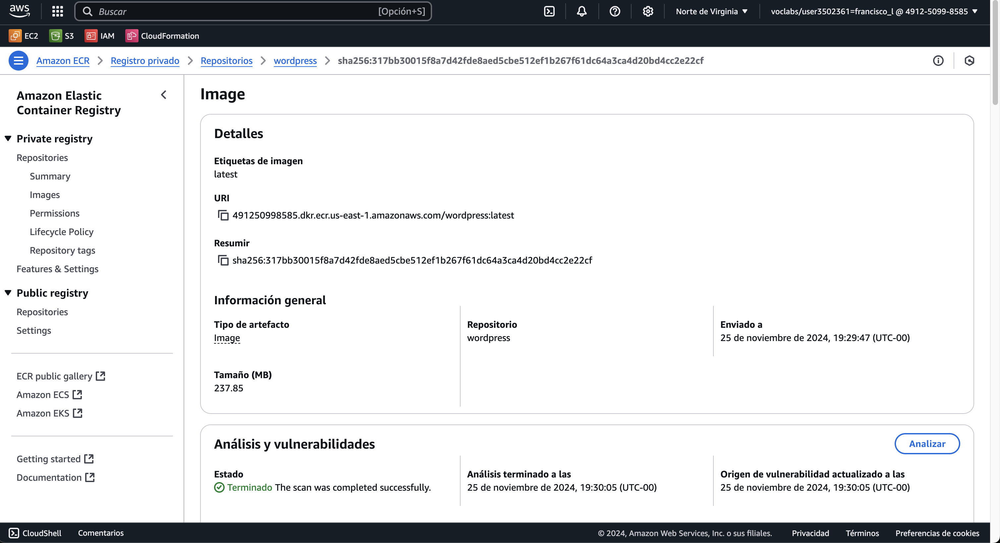

# Práctica 4 - Contenedores en AWS con ECS

**Asignatura**: Computación en la Nube

**Fecha**: [Fecha de entrega]

**Autor**: Francisco Javier López-Dufour Morales

<br><br><br>

<div class="page"/>

## Índice

- [Práctica 4 - Contenedores en AWS con ECS](#práctica-4---contenedores-en-aws-con-ecs)
  - [Índice](#índice)
  - [1. Introducción](#1-introducción)
  - [2. Objetivos](#2-objetivos)
  - [3. Descripción de Actividades](#3-descripción-de-actividades)
    - [3.1. Creación de un contenedor Docker con una aplicación](#31-creación-de-un-contenedor-docker-con-una-aplicación)
    - [3.2. Creación de un repositorio en ECR y subida del contenedor](#32-creación-de-un-repositorio-en-ecr-y-subida-del-contenedor)
    - [3.3. Despliegue del contenedor usando ECS](#33-despliegue-del-contenedor-usando-ecs)
    - [3.4. Despliegue del contenedor usando Fargate y comparación](#34-despliegue-del-contenedor-usando-fargate-y-comparación)
    - [3.5. Actividad Extra 1 (Opcional): Automatización con CloudFormation](#35-actividad-extra-1-opcional-automatización-con-cloudformation)
    - [3.6. Actividad Extra 2 (Opcional): Despliegue de un cluster con varios contenedores](#36-actividad-extra-2-opcional-despliegue-de-un-cluster-con-varios-contenedores)
  - [4. Conclusiones](#4-conclusiones)
  - [5. Referencias](#5-referencias)
  - [6. Anexos](#6-anexos)
    - [Anexo 1: Docker Compose para WordPress y MariaDB](#anexo-1-docker-compose-para-wordpress-y-mariadb)
    - [Anexo 2: Implementación de la tarea en ECS (Punto 3.1)](#anexo-2-implementación-de-la-tarea-en-ecs-punto-31)

<div class="page"/>

## 1. Introducción

En esta práctica exploraremos el uso de contenedores en AWS utilizando el servicio Amazon Elastic Container Service (ECS). El objetivo es familiarizarse con la creación y despliegue de contenedores Docker en AWS, gestionando repositorios en ECR y comparando diferentes métodos de despliegue, incluyendo Fargate.

<div class="page"/>

## 2. Objetivos

- Crear un contenedor Docker con una aplicación sencilla para comprobar su funcionamiento.
- Configurar un repositorio en Amazon ECR y subir el contenedor creado.
- Desplegar el contenedor usando Amazon ECS.
- Desplegar el contenedor usando AWS Fargate y comparar la experiencia con el despliegue anterior.
- (Opcional) Automatizar el procedimiento utilizando AWS CloudFormation y scripts para minimizar el uso del cliente web de AWS.
- (Opcional) Extender el despliegue para implementar un cluster con varios contenedores distintos.

<div class="page"/>

## 3. Descripción de Actividades

### 3.1. Creación de un contenedor Docker con una aplicación

**Descripción**: Crear un contenedor Docker que contenga una aplicación que permita comprobar su funcionamiento, como por ejemplo una página web sencilla.

**Conceptos Clave**:

- **ECS** (_Elastic Container Service_): Servicio de orquestación de contenedores que permite ejecutar y escalar aplicaciones en contenedores.
- **Clúster ECS**: Conjunto lógico de recursos en el que se ejecutan las tareas y servicios de ECS.
- **Definición de Tarea** (_Task Definition_): Plantilla que describe uno o más contenedores (por ejemplo, imagen de contenedor, variables de entorno, puertos, volúmenes).
- **Servicio ECS**: Gestiona la ejecución de tareas y asegura que se mantenga el número deseado de tareas en ejecución.

**Pasos a seguir**:

1. **Instalar Docker**:

   - Asegurarse de tener Docker instalado en el sistema local.
   - [Guía de instalación de Docker](https://docs.docker.com/get-docker/)

2. **Crear la aplicación**:

   - Vamos a utilizar una aplicación existente, WordPress, para simplificar la configuración.
   - Descargamos la imagen oficial de WordPress desde Docker Hub: `docker pull wordpress:latest`
   - Descargar también la imagen de MariaDB para la base de datos: `docker pull mariadb:latest`

3. **Escribir el Dockerfile**:

   - Crear un archivo `docker-compose.yml` que defina los servicios de WordPress y MariaDB.
   - Ejemplo de `docker-compose.yml`: [Anexo 1](#anexo-1-docker-compose-para-wordpress-y-mariadb)

4. **Construir y ejecutar los contenedores**:

   - Ejecutar el comando para construir y ejecutar los contenedores:

     ```bash
     docker-compose up
     ```

5. **Probar el contenedor localmente**:

   - Acceder a `http://localhost` para comprobar que la aplicación de WordPress funciona.

  

<div class="page"/>

### 3.2. Creación de un repositorio en ECR y subida del contenedor

> **Descripción**: Configurar un repositorio en Amazon Elastic Container Registry (ECR) y subir la imagen del contenedor creado en el paso anterior.

**Pasos**:

1. **Creación del repositorio en ECR**:

   - Accedemos a la consola de AWS ECR.
   - Creamos un nuevo repositorio privado.
   - Anotar el URI del repositorio: `[account].dkr.ecr.[region].amazonaws.com/my-app`.
     - En nuestro caso, el URI del repositorio quedaría: `491250998585.dkr.ecr.us-east-1.amazonaws.com/wordpress`
   - Mutabilidad de la imagen: Seleccionamos "Mutable" para poder sobreescribir la imagen.
   - Configuración de cifrado: Seleccionamos "KMS" y dejamos la configuración por defecto.
   - Análisis de imágenes: habilitamos la opción "Análisis de imágenes" para poder escanear las imágenes en busca de vulnerabilidades automáticamente al subirlas al repositorio.

2. **Configuración de las credenciales de AWS**:

   - Instalamos y configuramos AWS CLI en el sistema local.
   - [Guía de instalación de AWS CLI](https://docs.aws.amazon.com/cli/latest/userguide/cli-chap-install.html)
   - Configuramos las credenciales con `aws configure`.

3. **Iniciar sesión en ECR**:

   - Ejecutar el comando de inicio de sesión en ECR:

   ```bash
   aws ecr get-login-password --region [region] | docker login --username AWS --password-stdin [account].dkr.ecr.[region].amazonaws.com
   ```

   En nuestro caso:

   ```bash
   aws ecr get-login-password --region us-east-1 | docker login --username AWS --password-stdin 491250998585.dkr.ecr.us-east-1.amazonaws.com
   Login Succeeded
   ```

4. **Etiquetar la imagen para ECR**:

   - Etiquetar la imagen local para que coincida con el repositorio de ECR:

     ```bash
     docker tag my-app:latest [account].dkr.ecr.[region].amazonaws.com/my-app:latest
     ```

     En nuestro caso:

     ```bash
     docker tag wordpress:latest 491250998585.dkr.ecr.us-east-1.amazonaws.com/wordpress:latest
     docker tag mariadb:11.0.2 491250998585.dkr.ecr.us-east-1.amazonaws.com/mariadb:latest
     ```

5. **Subir la imagen a ECR**:

   - Ejecutar el comando para subir la imagen:

     ```bash
     docker push [account].dkr.ecr.[region].amazonaws.com/my-app:latest
     ```

     En nuestro caso:

     ```bash
     docker push 491250998585.dkr.ecr.us-east-1.amazonaws.com/wordpress:latest
     docker push 491250998585.dkr.ecr.us-east-1.amazonaws.com/mariadb:latest
     ```

6. **Verificar la imagen en ECR**:

   - Acceder a la consola de ECR y verificar que la imagen se ha subido correctamente.

   

<div class="page"/>

### 3.3. Despliegue del contenedor usando ECS

> **Descripción**: Ahora crearemos un clúster en ECS usando instancias EC2, definiendo la tarea y el servicio. Esto proporciona más control sobre la infraestructura subyacente, permitiendo por ejemplo el uso de tipos de instancia específicos y estrategias de escalado personalizadas.

**Pasos para crear un Clúster de ECS con Instancias EC2**:

1. **Crear un clúster de ECS**:

   - Acceder a la consola de Amazon ECS.
   - Crear un nuevo clúster (por ejemplo, con EC2 Linux + Networking).
     - Nombre: `wordpress-cluster`
   - Configuración de la Infraestructura:
     - Instancias EC2
     - Grupo de Auto Scaling: Crear un nuevo grupo de Auto Scaling.
     - Modelo de aprovisionamiento: `On-Demand`.
     - Imagen de la máquina EC2: `Amazon Linux 2 (kernel 5.10/arm64)`.
       - Es importante seleccionar una imagen compatible con ARM si vamos a utilizar instancias ARM.
     - Tipo de instancias EC2: `t2.medium` para soportar la carga de WordPress y la base de datos. Ajustar según las necesidades de la aplicación.
       - **Nota**: Ajustar el tipo de instancia según los requisitos de la aplicación.
     - Rol de instancia: Crear un nuevo rol de IAM o seleccionar uno existente. (`LabInstanceProfile` en nuestro caso).
     - Capacidad deseada:
       - Número de instancias: `1`.
       - Capacidad máxima: `2`.
     - Par de claves: Seleccionar un par de claves existente o crear uno nuevo. (`vockey` en nuestro caso).
     - Tamaño del volumen raíz: `30 GiB`.
   - Configuración de la red:
     - VPC: Seleccionamos la VPC por defecto.
     - Subredes: Seleccionamos todas las subredes.
     - Grupo de seguridad: Crear un nuevo grupo de seguridad o seleccionar uno existente.
       - Debemos asegurarnos de que permite tráfico en los puertos necesarios (80 para HTTP y 3306 para MariaDB).
     - Balanceador de carga: No seleccionar balanceador de carga.
     - Asignar automáticamente direcciones IP públicas: `Activado`.
   - Monitoreo, Cifrado y Etiquetas: Mantenemos la configuración por defecto.

Resumen de la configuración:


**Nota**: Debemos asegurarnos de que las imágenes de los contenedores soporten la arquitectura elegida.

2. **Definir una tarea (_Task Definition_)**:

Como estamos ejecutando dos contenedores (WordPress y MariaDB) que necesitan comunicarse entre sí, usaremos una definición de tarea que incluye ambos contenedores.

- Accedemos a **Definiciones de Tareas** en la consola de ECS.
  - Familia de la tarea: `wordpress-task`.
  - Requisitos de infraestructura:
    - Tipo de Lanzamiento: `EC2`.
    - Sistema operativo: `Linux/ARM64`.
      - **Nota**: Si estamos utilizando instancias ARM, debemos asegurarnos de que las imágenes de los contenedores son compatibles con ARM.
    - Modo de red: `awsvpc`.
    - CPU: `1 vCPU`.
    - Memoria: `1 GB`.
      - **Nota**: Ajustar la memoria y CPU según los requisitos de la aplicación.
    - Rol de tarea: Crear un nuevo rol de IAM o seleccionar uno existente. (`LabRole` en nuestro caso).
    - Rol de ejecución de tareas: Crear un nuevo rol de IAM o seleccionar uno existente. (`LabRole` en nuestro caso).
  - Contenedor 1: mariadb
    - Nombre: `mariadb`.
    - Contenedor esencial: `Si`.
    - URI de la imagen: `491250998585.dkr.ecr.us-east-1.amazonaws.com/mariadb:latest`.
    - Mapeo de puertos:
      - Puerto de anfitrión: `0`. (mapeo dinámico al host).
      - Puerto de contenedor: `3306`.
      - Protocolo: `tcp`.
      - Nombre: `mariadb-3306-tcp`.
    - Variables de entorno:
      - `MYSQL_ROOT_PASSWORD`: root
      - `MYSQL_DATABASE`: wordpress
      - `MYSQL_USER`: wordpress
      - `MYSQL_PASSWORD`: wordpress
  - Contenedor 2: **wordpress**
    - Nombre: `wordpress`.
    - URI de la imagen: `491250998585.dkr.ecr.us-east-1.amazonaws.com/wordpress:latest`.
    - Contenedor esencial: `Si`.
    - Mapeo de puertos:
      - Puerto de anfitrión: `80`.
      - Puerto de contenedor: `80`.
      - Protocolo: `tcp`.
      - Nombre: `wordpress-80-tcp`.
      - Protocolo de la aplicación: `http`.
    - Ordenación de la dependencia de inicio:
      - Nombre del contenedor: `mariadb`. Condiciones: `Start`. (Para asegurar que MariaDB se inicia antes de WordPress).
    - Variables de entorno:
      - `WORDPRESS_DB_HOST`: mariadb:3306
      - `WORDPRESS_DB_USER`: wordpress
      - `WORDPRESS_DB_PASSWORD`: wordpress
      - `WORDPRESS_DB_NAME`: wordpress
    - Configuración de red de contenedores:
      - Enlaces: `mariadb`. Alias: `mariadb`. (Como estamos utilizando el modo bridge, necesitamos enlazar los contenedores para que puedan comunicarse).

Resumen de la configuración:


Esta configuración centralizada en la `Task Definition` proporciona una plantilla reutilizable, facilitando futuras actualizaciones y despliegues.

3. **Crear un servicio de ECS**:

   - Acceder a Servicios:
     - En la consola de ECS, seleccionamos `Clusters`, luego seleccionamos nuestro clúster `wordpress-cluster` y procedemos a crear un servicio.
   - Configuración el Servicio:
     - Entorno:
       - Tipo de lanzamiento: `EC2`.
     - Configuración de la implementación:
       - Tipo de implementación: `Servicio`.
       - Familia de la tarea: `wordpress-task`. (la definición de tarea que creamos anteriormente).
       - Nombre del servicio: `wordpress-service`.
       - Tipo de servicio: `REPLICA`. (para mantener un número fijo de tareas en ejecución).
       - Tareas deseadas: `1`.
   - Mantenemos las opciones por defecto en el resto de las secciones.

Resumen de la configuración:


El servicio mantiene el número de tareas especificado en ejecución, lo que aporta resiliencia ante fallos. La creación del servicio permite escalar el número de contenedores de forma dinámica y asegura alta disponibilidad (si se configura con múltiples tareas y balanceador de carga).

4. **Probar el despliegue**:
   - Comprobar que las instancias de tarea están en ejecución.
     - 
   - Obtener la dirección IP o el balanceador de carga para acceder a la aplicación.
     - En nuestro caso, la dirección IP pública de la instancia EC2 es `ec2-54-144-88-19.compute-1.amazonaws.com`


**Notas**:

- Debemos asegurarnos de que el rol de ejecución de tareas de ECS (`ECS Task Execution Role`) tenga permisos suficientes para acceder a ECR.
- Verificar que el grupo de seguridad permita tráfico en el puerto `80`.
- Ajustar recursos según las necesidades reales, evitando sobrecostes o subdimensionamiento.

5. **Arquitectura Final**:


La arquitectura final incluye un clúster de ECS con instancias EC2, una definición de tarea con dos contenedores (WordPress y MariaDB) y un servicio que mantiene una tarea en ejecución. La comunicación entre los contenedores se realiza a través de la red interna de ECS.

6. **Análisis de Costos**:


Los costos principales se dividen entre instancias EC2 ($16.86 USD/mes), almacenamiento de imágenes en ECR ($0.08 USD/mes), y transferencia de datos ($9.00 USD/mes). Los costos adicionales opcionales incluyen balanceadores de carga (ELB), almacenamiento adicional (EBS) y monitoreo (CloudWatch).

| Servicio                      | Costo Mensual (USD) | Costo Anual (USD) |
|-------------------------------|---------------------|-------------------|
| **Amazon EC2**                | $16.86             | $202.32           |
| **Amazon Elastic Container Registry (ECR)** | $0.08              | $0.96             |
| **AWS Data Transfer**         | $9.00              | $108.00           |
| **Elastic Load Balancer (ELB)** (opcional) | ~$16.20          | ~$194.40          |
| **Almacenamiento EBS** (opcional) | $1.00           | $12.00            |
| **AWS CloudWatch** (opcional) | ~$1.10             | ~$13.20           |
| **Total Estimado**            | **$27.94 - $44.24** | **$335.28 - $530.88** |


<div class="page"/>

### 3.4. Despliegue del contenedor usando Fargate y comparación

> **Descripción**: Desplegar la misma aplicación (WordPress y MariaDB) en AWS ECS, pero empleando el tipo de lanzamiento Fargate en lugar de EC2. Esto facilitará la comparación entre ambas opciones, resaltando las diferencias en la gestión de infraestructura, costos, escalabilidad y simplicidad de la operación.

**Consideraciones Previas**:

- Arquitectura sin servidores (Serverless): Fargate es un servicio serverless que permite ejecutar contenedores sin necesidad de gestionar servidores, clústeres ni instancias EC2 subyacentes. Esto simplifica el mantenimiento pero puede tener un impacto en el costo.

**Compatibilidad y Requerimientos**:

- Asegurar que las imágenes y configuraciones empleadas anteriormente (WordPress, MariaDB) sean compatibles con Fargate. Normalmente lo son, pero es importante recordar:
  - Fargate no soporta el modo de red `bridge`, así que en la `Task Definition` hay que emplear `awsvpc`.
  - Cada contenedor debe contar con puertos definidos en el modo awsvpc.

**Costos y Dimensionamiento**:

- Con Fargate se paga por tiempo de cómputo y recursos asignados (vCPU y RAM) a las tareas, no por la infraestructura persistente como en EC2. Ajustar adecuadamente la CPU y la memoria asignadas a la `Task Definition` evitará sobrecostos.

Pasos para el Despliegue:

1. **Crear o Actualizar la Task Definition para Fargate**:

- En la consola de ECS, ir a Task Definitions y crear una nueva definición o clonar la que ya existe para EC2.
- Seleccionar el tipo de lanzamiento FARGATE en lugar de EC2.
- Asegurarse de que el modo de red (Network Mode) esté configurado en awsvpc.
- Definir las compatibilidades con Fargate (FARGATE) y seleccionar la plataforma adecuada (Linux/AMD64 o Linux/ARM64, dependiendo de las imágenes).
- Asignar los recursos de CPU y memoria adecuados. Por ejemplo:
- CPU: 512 (0.5 vCPU)
- Memoria: 1024 (1GB)
  Estos valores pueden ajustarse según las necesidades de la aplicación.
- En la sección de contenedores:
- Configurar el contenedor de MariaDB y el de WordPress con las mismas variables de entorno y URIs de imagen que se emplearon en el despliegue anterior.
- Especificar mapeos de puertos. Por ejemplo, para WordPress:
- Puerto del contenedor: 80.
- No es necesario mapear a un puerto de host (en Fargate el puerto del host se asigna automáticamente).
- Retirar dependencias de tipo links ya que con awsvpc cada contenedor obtiene su propia interfaz de red y se comunican a través de la dirección interna asignada por la VPC (usando el nombre del contenedor como referencia en las variables de entorno).

2. **Configurar la Red y Seguridad**:

- Seleccionar una VPC y subredes con conectividad apropiada. Para Fargate es común usar subredes privadas con un NAT Gateway para tráfico saliente, o subredes públicas si se requiere acceso directo desde Internet.
- Asegurarse de que el Security Group permita tráfico entrante en el puerto 80 (HTTP) para WordPress, y que el tráfico interno a la base de datos (3306) se limite al rango de IPs interno o al propio clúster.
- Asignar una IP pública, si se requiere, al momento de crear el servicio. Esto se realiza seleccionando las subredes públicas y el checkbox de asignación automática de IP pública.

3. **Crear el Servicio en Modo Fargate**:

- En la consola de ECS, ir a la sección “Servicios” dentro del clúster existente o crear uno nuevo si se desea separar ambientes.
- Crear un servicio con la nueva Task Definition para Fargate.
- Tipo de lanzamiento: FARGATE.
- Elegir la VPC y subredes configuradas para Fargate.
- Seleccionar el número de tareas deseadas (por ejemplo, 1).
- Revisar que el rol de ejecución de tareas (Task Execution Role) tenga permisos para extraer imágenes de ECR y que las políticas de IAM estén en orden.
- Opcionalmente, configurar un Application Load Balancer si se desea equilibrar el tráfico a través de múltiples tareas o servicios.

4. **Desplegar y Probar**:

- Crear el servicio y esperar a que las tareas se inicien.
- Una vez en estado RUNNING, obtener la dirección IP pública asignada a la tarea o el DNS del balanceador de carga, si se configuró uno.
- Acceder desde el navegador a la URL y verificar que WordPress funcione correctamente.
- Confirmar que la base de datos está funcionando y que se puede completar la instalación inicial de WordPress.

5. **Comparación con el Despliegue en EC2**:

Tras validar el correcto funcionamiento, analizar las diferencias entre el despliegue sobre EC2 y sobre Fargate:

- Gestión de Infraestructura:
- EC2: Requiere gestionar AMIs, tipos de instancia, Auto Scaling Groups y la capa subyacente.
- Fargate: No se gestionan servidores; solo se especifican requisitos de CPU, RAM y VPC.
- Costos:
- EC2: Se paga por tiempo de ejecución de las instancias (24/7 si están encendidas).
- Fargate: Se paga por segundo de ejecución de tareas y los recursos asignados a las mismas.
- Escalabilidad:
- EC2: Escalar implica lanzar o apagar instancias EC2 adicionales.
- Fargate: Escalar tareas horizontalmente es más simple, no requiere nuevas instancias, solo aumentar el número de tareas.
- Mantenimiento:
- EC2: Hay que mantener el AMI y parches del SO base.
- Fargate: AWS se encarga del mantenimiento del entorno base.

6. **Optimización y Buenas Prácticas**:

- Ajustar los recursos de CPU y memoria según la carga real de la aplicación.
- Considerar el uso de ALB (Application Load Balancer) para exponer el servicio a Internet y equilibrar la carga entre múltiples tareas Fargate.
- Monitorizar el uso de recursos con CloudWatch para optimizar costos y rendimiento.
- Si se requiere persistencia de datos a largo plazo, evaluar opciones como RDS para la base de datos en lugar de un contenedor interno, asegurando mayor durabilidad y respaldo.

<div class="page"/>

### 3.5. Actividad Extra 1 (Opcional): Automatización con CloudFormation

<div class="page"/>

### 3.6. Actividad Extra 2 (Opcional): Despliegue de un cluster con varios contenedores

<div class="page"/>

## 4. Conclusiones

<div class="page"/>

## 5. Referencias

- [Amazon ECS Developer Guide](https://docs.aws.amazon.com/AmazonECS/latest/developerguide/Welcome.html)
- [Amazon ECR User Guide](https://docs.aws.amazon.com/AmazonECR/latest/userguide/what-is-ecr.html)
- [AWS Fargate Documentation](https://docs.aws.amazon.com/AmazonECS/latest/developerguide/AWS_Fargate.html)
- [Docker Documentation](https://docs.docker.com/)
- [AWS CLI Command Reference](https://docs.aws.amazon.com/cli/latest/reference/)

<div class="page"/>

## 6. Anexos

### Anexo 1: Docker Compose para WordPress y MariaDB

```yaml
version: '3.8'

services:
db:
  image: mariadb:11.0.2
  restart: always
  ports:
    - '3306:3306'
  environment:
    MYSQL_ROOT_PASSWORD: root
    MYSQL_DATABASE: wordpress
    MYSQL_USER: wordpress
    MYSQL_PASSWORD: wordpress
wordpress:
  image: wordpress:latest
  restart: always
  ports:
    - '80:80'
  depends_on:
    - db
  environment:
    WORDPRESS_DB_HOST: db:3306
    WORDPRESS_DB_USER: wordpress
    WORDPRESS_DB_PASSWORD: wordpress
    WORDPRESS_DB_NAME: wordpress
    WORDPRESS_CONFIG_EXTRA: |
      /** disable wp core auto update */
      define('WP_AUTO_UPDATE_CORE', false);
```

### Anexo 2: Implementación de la tarea en ECS (Punto 3.1)

```json
{
  "family": "wordpress-task",
  "containerDefinitions": [
    {
      "name": "mariadb",
      "image": "491250998585.dkr.ecr.us-east-1.amazonaws.com/mariadb:latest",
      "cpu": 0,
      "portMappings": [
        {
          "name": "mariadb-3306-tcp",
          "containerPort": 3306,
          "hostPort": 0,
          "protocol": "tcp"
        }
      ],
      "essential": true,
      "environment": [
        {
          "name": "MYSQL_DATABASE",
          "value": "wordpress"
        },
        {
          "name": "MYSQL_PASSWORD",
          "value": "wordpress"
        },
        {
          "name": "MYSQL_ROOT_PASSWORD",
          "value": "root"
        },
        {
          "name": "MYSQL_USER",
          "value": "wordpress"
        }
      ],
      "environmentFiles": [],
      "mountPoints": [],
      "volumesFrom": [],
      "ulimits": [],
      "systemControls": []
    },
    {
      "name": "wordpress",
      "image": "491250998585.dkr.ecr.us-east-1.amazonaws.com/wordpress:latest",
      "cpu": 0,
      "links": ["mariadb:mariadb"],
      "portMappings": [
        {
          "name": "wordpress-80-tcp",
          "containerPort": 80,
          "hostPort": 80,
          "protocol": "tcp",
          "appProtocol": "http"
        }
      ],
      "essential": true,
      "environment": [
        {
          "name": "WORDPRESS_DB_USER",
          "value": "wordpress"
        },
        {
          "name": "WORDPRESS_DB_HOST",
          "value": "mariadb:3306"
        },
        {
          "name": "WORDPRESS_DB_PASSWORD",
          "value": "wordpress"
        },
        {
          "name": "WORDPRESS_DB_NAME",
          "value": "wordpress"
        }
      ],
      "environmentFiles": [],
      "mountPoints": [],
      "volumesFrom": [],
      "dependsOn": [
        {
          "containerName": "mariadb",
          "condition": "START"
        }
      ],
      "systemControls": []
    }
  ],
  "taskRoleArn": "arn:aws:iam::491250998585:role/LabRole",
  "executionRoleArn": "arn:aws:iam::491250998585:role/LabRole",
  "networkMode": "bridge",
  "volumes": [],
  "placementConstraints": [],
  "requiresCompatibilities": ["EC2"],
  "cpu": "1024",
  "memory": "1024",
  "runtimePlatform": {
    "cpuArchitecture": "ARM64",
    "operatingSystemFamily": "LINUX"
  }
}
```
