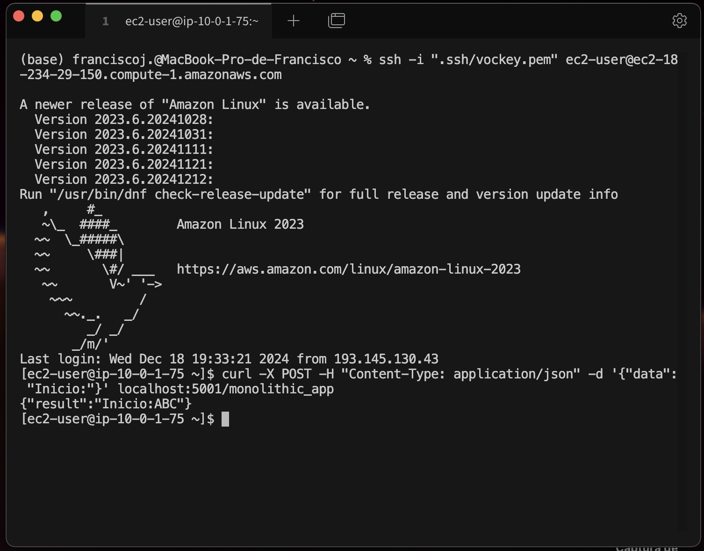
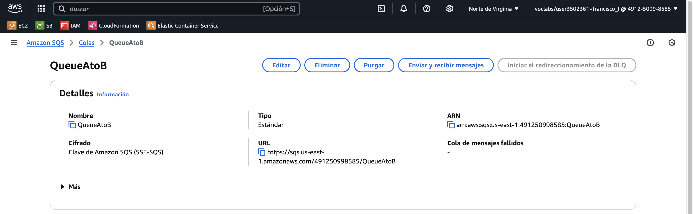
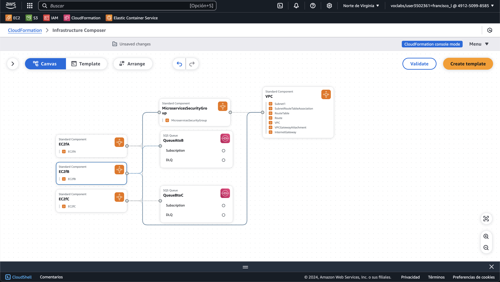
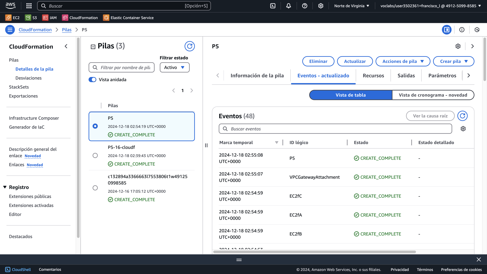
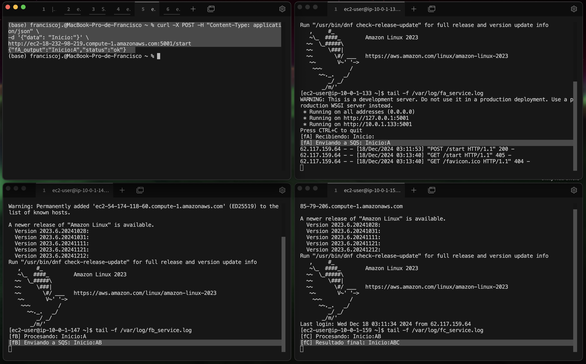
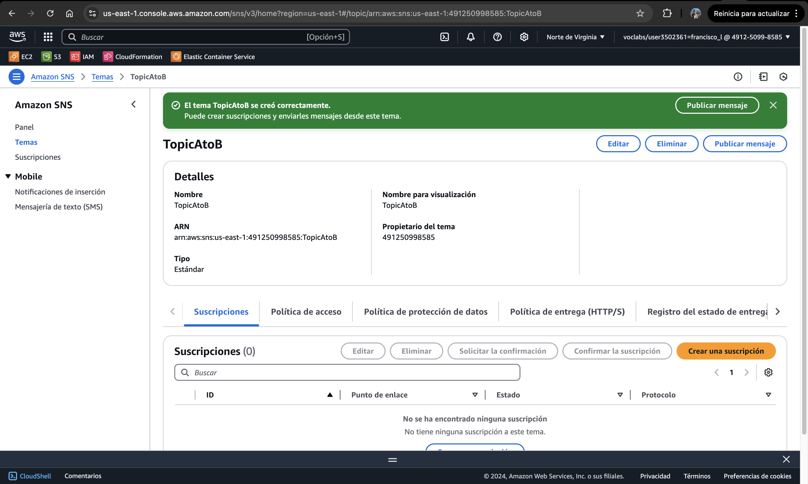
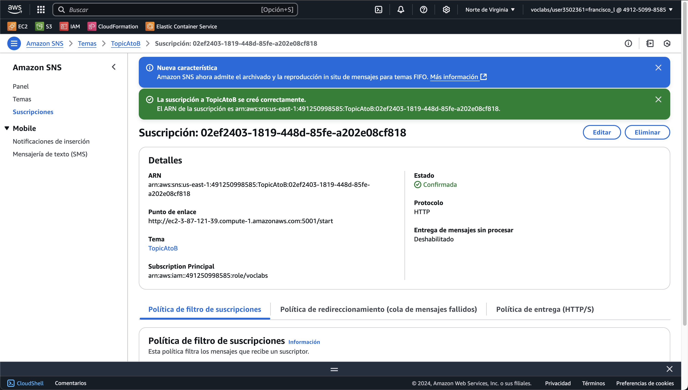
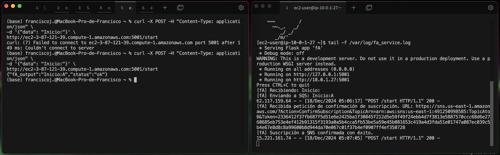
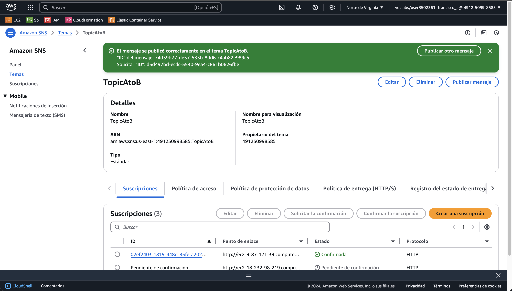
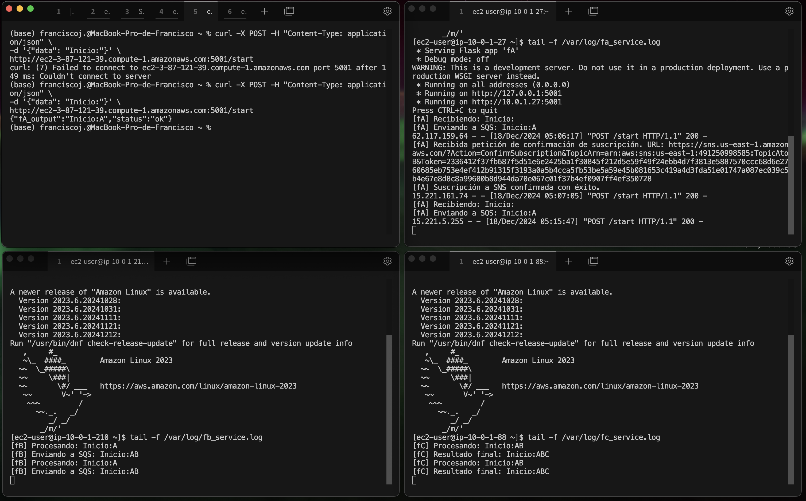

# Práctica 5 - Desacoplamiento con Colas y Eventos en AWS

**Asignatura**: Computación en la Nube  

**Fecha**: 20-12-2024

**Autor**: Francisco Javier López-Dufour Morales

<br>
<br> 
<br>
<br>
<br>


<div class="page"/>

## Índice

- [Práctica 5 - Desacoplamiento con Colas y Eventos en AWS](#práctica-5---desacoplamiento-con-colas-y-eventos-en-aws)
  - [Índice](#índice)
  - [1. Introducción](#1-introducción)
  - [2. Objetivos](#2-objetivos)
  - [3. Descripción de Actividades](#3-descripción-de-actividades)
    - [3.1. Implementación de la aplicación monolítica](#31-implementación-de-la-aplicación-monolítica)
    - [3.2. Desacoplamiento en tres microservicios y uso de colas](#32-desacoplamiento-en-tres-microservicios-y-uso-de-colas)
      - [3.2.1. Creación de las colas SQS](#321-creación-de-las-colas-sqs)
      - [3.2.2. Creación de los tres microservicios](#322-creación-de-los-tres-microservicios)
      - [3.2.3. Despliegue de los microservicios en EC2 mediante CloudFormation](#323-despliegue-de-los-microservicios-en-ec2-mediante-cloudformation)
    - [3.3. Configuración de Amazon SNS y suscripción de fA](#33-configuración-de-amazon-sns-y-suscripción-de-fa)
  - [4. Diagrama de la Arquitectura Desplegada](#4-diagrama-de-la-arquitectura-desplegada)
  - [5. Presupuesto y Estimación de Costos](#5-presupuesto-y-estimación-de-costos)
  - [6. Conclusiones](#6-conclusiones)
  - [7. Referencias](#7-referencias)
  - [8. Anexos](#8-anexos)
    - [Anexo A: Código de las funciones monolíticas](#anexo-a-código-de-las-funciones-monolíticas)
    - [Anexo B: Plantilla de CloudFormation aplicación monolítica](#anexo-b-plantilla-de-cloudformation-aplicación-monolítica)
    - [Anexo C: Código de las funciones desacopladas](#anexo-c-código-de-las-funciones-desacopladas)
    - [Anexo D: Plantilla de CloudFormation aplicación desacoplada](#anexo-d-plantilla-de-cloudformation-aplicación-desacoplada)
    - [Anexo E: Plantilla de CloudFormation con SNS](#anexo-e-plantilla-de-cloudformation-con-sns)

<div class="page"/>

## 1. Introducción

En esta práctica se trabajará con **colas y eventos de AWS** para desacoplar una aplicación inicial (monolítica) en un **conjunto de microservicios escalable**. Se experimentará con servicios de AWS como **Amazon SQS** y **Amazon SNS**, creando flujos asíncronos entre las distintas funciones y facilitando la comunicación desacoplada.

<div class="page"/>

## 2. Objetivos

1. Desplegar en AWS una aplicación sencilla compuesta por **tres funciones**: `fA`, `fB` y `fC`.
2. Dividir la aplicación monolítica en tres aplicaciones independientes que se comuniquen mediante **colas** (p.ej., **SQS** o **Redis**).
3. Configurar un **topic** de Amazon SNS para suministrar datos a `fA`.

<div class="page"/>

## 3. Descripción de Actividades

### 3.1. Implementación de la aplicación monolítica

**Objetivo**: Crear una aplicación simple con **tres funciones** (`fA`, `fB`, `fC`) que se invoquen secuencialmente:

- `fA` → `fB` → `fC`
- Cada función hace un _wait_ (o _sleep_) de unos segundos antes de devolver su resultado.

**Pasos para la implementación**:

1. **Lenguaje elegido** `Python`.
2. **Implementación de las funciones** `fA`, `fB` y `fC` con las esperas indicadas:

   - Anexo con el código de las funciones: [Anexo A](#anexo-a-código-de-las-funciones-monolíticas).

3. **Comprobar** el correcto funcionamiento en local.

```bash
$ python monolithic_app.py
Comienzo de la ejecución monolítica con w = Inicio:
[fA] Recibiendo: Inicio:
[fB] Recibiendo: Inicio:A
[fC] Recibiendo: Inicio:AB
Resultado final del flujo: Inicio:ABC
```

4. **Despliegue en AWS** de las funciones en instancias EC2 utilizando **CloudFormation**. 

  - Código de la plantilla de CloudFormation: [Anexo B](#anexo-b-plantilla-de-cloudformation-aplicación-monolítica).

5. **Comprobar** el correcto funcionamiento en AWS.



---

### 3.2. Desacoplamiento en tres microservicios y uso de colas

> **Objetivo**: Crear **tres aplicaciones independientes** (`fA`, `fB`, `fC`) y conectarlas mediante **colas SQS** para que la salida de una sea la entrada de la siguiente.

#### 3.2.1. Creación de las colas SQS

1. **Creación de la cola A→B** (`QueueAtoB`):
   - **Nombre**: `QueueAtoB`
   - **Configuración**:
     - **Tiempo de retención**: 1 minuto
     - **Visibilidad**: 30 segundos
   - **Cifrado**:
     - **Cifrado del servidor**: Habilitado
     - **Encryption key type**: Clave de Amazon SQS (SSE-SQS)
   - **Política de acceso**:
     - **Método**: básico
     - **Quién puede enviar mensajes**: solo el propietario de la cola
     - **Quién puede recibir mensajes**: solo el propietario de la cola
   - Mantenemos el resto de opciones por defecto.
   - URL de la cola: `https://sqs.{region}.amazonaws.com/{account-id}/QueueAtoB`



2. **Creación de la cola B→C** (`QueueBtoC`):
   - **Nombre**: `QueueBtoC`
   - **Configuración**:
     - **Tiempo de retención**: 1 minuto
     - **Visibilidad**: 30 segundos
   - **Cifrado**:
     - **Cifrado del servidor**: Habilitado
     - **Encryption key type**: Clave de Amazon SQS (SSE-SQS)
   - **Política de acceso**:
     - **Método**: básico
     - **Quién puede enviar mensajes**: solo el propietario de la cola
     - **Quién puede recibir mensajes**: solo el propietario de la cola
   - Mantenemos el de opciones por defecto.
   - URL de la cola: `https://sqs.{region}.amazonaws.com/{account-id}/QueueBtoC`


**NOTA**: este paso lo vamos a realizar de nuevo pero integrado en la plantilla de CloudFormation.

#### 3.2.2. Creación de los tres microservicios

Creamos tres microservicios independientes (`fA`, `fB`, `fC`) que se comunican mediante colas SQS:

- **fA**: Expone un endpoint `/start`. Al recibir una petición POST, procesa el dato, añade `"A"` y envía el resultado a `QueueAtoB`.
- **fB**: Hace “polling” de `QueueAtoB`. Cada mensaje lo procesa añadiendo `"B"` y lo reenvía a `QueueBtoC`.
- **fC**: Hace “polling” de `QueueBtoC`. Cada mensaje lo procesa añadiendo `"C"` y muestra el resultado final.

Este desacoplamiento permite mayor flexibilidad, tolerancia a fallos y escalabilidad en la arquitectura.

El código de cada microservicio se encuentra en los anexos: [Anexo C](#anexo-c-código-de-las-funciones-desacopladas).

#### 3.2.3. Despliegue de los microservicios en EC2 mediante CloudFormation

Se utilizó una plantilla de CloudFormation para: 

1. Crear la infraestructura (VPC, Subnet, Security Group, ...) necesaria para las instancias EC2.
2. Desplegar tres instancias EC2 con scripts de inicio (`UserData`) que instalan las dependencias, definen variables de entorno y ejecutan cada microservicio.
3. Crear las colas SQS (`QueueAtoB` y `QueueBtoC`).

El código de la plantilla CloudFormation se encuentra en el [Anexo D](#anexo-d-plantilla-de-cloudformation-aplicación-desacoplada).




Tras el despliegue:

- Al enviar una petición a `fA`, la respuesta muestra `"Inicio:A"`.
- `fB` lee `Inicio:A` de `QueueAtoB`, genera `Inicio:AB` y lo envía a `QueueBtoC`.
- `fC` recibe `Inicio:AB`, genera `Inicio:ABC` y muestra el resultado final.

Los logs en las instancias confirman el correcto flujo:

- `fA` recibe `"Inicio:"` y envía `"Inicio:A"`.
- `fB` procesa `"Inicio:A"` y envía `"Inicio:AB"`.
- `fC` procesa `"Inicio:AB"` y muestra `"Inicio:ABC"`.



Este resultado demuestra que el desacoplamiento mediante colas SQS funciona correctamente.

<div class="page"/>

### 3.3. Configuración de Amazon SNS y suscripción de fA

> **Objetivo**: Permitir que `fA` reciba datos de entrada desde un **Topic** de Amazon SNS. De esta forma, en lugar de iniciar el flujo enviando una petición HTTP manual a `fA`, cualquier evento o publicación en el **Topic SNS** desencadenará la ejecución del flujo en `fA`.

**Pasos a seguir**:

1. **Crear un Topic en Amazon SNS**  
   - En la consola de AWS, vamos a **Amazon SNS**/**Temas**/**Crear tema**.
   - Detalles
     - **Tipo de tema**: Estándar
     - **Nombre**: `TopicAtoB`
     - **Nombre para visualización**: `TopicAtoB`
     - Mantenemos el resto de opciones por defecto.

    

2. **Obtener el Endpoint Público de fA**  
   - Desde la consola EC2, ubicamos la instancia que corre `fA`.
   - Copiamos su **Public DNS** o **Public IP**.
   - En nuestro caso, `fA` escucha en el puerto **5001**, por lo que el endpoint será algo como:  
     `http://<PublicDNS>:5001/start`

3. **Crear una suscripción HTTP al Topic SNS**  
   - En Amazon SNS: **Temas**, seleccionamos el `Tema` recién creado.
   - Click en **Crear una suscripción**.
   - **Protocolo**: `HTTP`
   - **Punto de enlace**: `http://ec2-18-232-98-219.compute-1.amazonaws.com:5001/start`

    

4. **Confirmar la Suscripción en fA**  
   - SNS enviará una petición `POST` al endpoint `/start` para confirmar la suscripción.
   - En los logs de `fA` (`/var/log/fa_service.log`) se podrá ver un mensaje indicando la recepción de la confirmación de suscripción. `fA` deberá responder con un código `200` para validar la suscripción.

    

5. **Probar la Integración**  
   - Publicar un mensaje en el Topic SNS (ej. “Un mensaje para gobernarlos a todos desde SNS”).  
   - `fA` recibirá el mensaje vía HTTP, lo procesará y lo enviará a `QueueAtoB`. A partir de ahí, el flujo continuará como en el paso anterior.

    

    <br>

    

Esta integración añade mayor flexibilidad: ahora `fA` no sólo responde a peticiones manuales, sino también a eventos externos publicados en un Topic SNS, manteniendo el diseño desacoplado y escalable.

El código de la plantilla CloudFormation con SNS se encuentra en el [Anexo E](#anexo-e-plantilla-de-cloudformation-con-sns).


<div class="page"/>

## 4. Diagrama de la Arquitectura Desplegada

El siguiente diagrama muestra la arquitectura desplegada en AWS:


En este diseño, cada microservicio (`fA`, `fB`, `fC`) se ejecuta en una instancia EC2 independiente. Los microservicios se comunican entre sí mediante colas SQS (`QueueAtoB`, `QueueBtoC`), lo que permite un desacoplamiento total entre ellos. Además, `fA` recibe datos de entrada desde un Topic SNS, lo que añade flexibilidad y escalabilidad al sistema.

## 5. Presupuesto y Estimación de Costos

Para la estimación de costos, se consideran los siguientes elementos:

- **Instancias EC2**: se desplegaron tres instancias EC2 (una por microservicio) con el tipo `t2.micro`.
- **Colas SQS**: se crearon dos colas `SQS` para el desacoplamiento de los microservicios.
- **Tráfico de red**: se considera el tráfico de red entre las instancias EC2 y las colas SQS.
- **Amazon SNS**: se creó un Topic SNS con una suscripción HTTP.
- **Almacenamiento EBS**: se incluye el almacenamiento de las instancias EC2.
- **Transferencia de datos**: se considera el tráfico de datos entre los servicios.
- **CloudFormation**: se considera el uso de CloudFormation para la creación de la infraestructura.
- **Región**: se utilizó la región `us-east-1` (N. Virginia).
- **Precio**: se consideran los precios de AWS en la región `us-east-1` al momento de la práctica.
- **Duración**: se considera un mes de uso continuo de los servicios.
- **Costos**: se presentan los costos estimados en dólares americanos.

**Costos Estimados**

| Servicio                                    | Costo Mensual (USD) | Costo Anual (USD)     |
|---------------------------------------------|---------------------|-----------------------|
| Instancias EC2 (3 x t2.micro)               | $12.70              | $152.40               |
| Colas SQS (2 x 1M mensajes)                 | $0.00               | $0.00                 |
| Tráfico de red (EC2 a SQS)                  | $0.00               | $0.00                 |
| Amazon SNS (1 x Topic)                      | $0.00               | $0.00                 |
| Almacenamiento EBS (3 x 8GB)                | $0.72               | $8.64                 |
| Transferencia de datos (1GB)                | $0.00               | $0.00                 |
| CloudFormation (1 stack)                    | $0.00               | $0.00                 |
| **Total**                                   | **$13.42**          | **$161.04**           |

## 6. Conclusiones

- La arquitectura desacoplada implementada en esta práctica demuestra cómo servicios como **Amazon SQS** y **Amazon SNS** pueden mejorar la escalabilidad, tolerancia a fallos y modularidad de una aplicación.

- El desacoplamiento permite que cada microservicio funcione de manera autónoma, facilitando el mantenimiento y la implementación de cambios sin afectar al resto del sistema.

- El despliegue en **EC2** aporta flexibilidad, pero introduce costos más elevados en comparación con **AWS Lambda** para escenarios de carga baja o moderada. Para cargas elevadas, la solución actual es más adecuada debido al control total sobre las instancias.

- En términos de costos, el uso de **SQS** y **SNS** resulta económico para esta escala, aunque el análisis debe incluir escenarios de carga alta para validar la sostenibilidad.

<div class="page"/>

## 7. Referencias

1. [AWS Docs - Ejemplos en GitHub](https://github.com/awsdocs/aws-doc-sdk-examples)
2. [AWS SQS Documentation](https://docs.aws.amazon.com/sqs/)
3. [AWS SNS Documentation](https://docs.aws.amazon.com/sns/)
4. [AWS CloudFormation Documentation](https://docs.aws.amazon.com/cloudformation/)

<div class="page"/>

## 8. Anexos

### Anexo A: Código de las funciones monolíticas

```python
# monolithic_app.py
import time

def fA(dataA):
    print("[fA] Recibiendo:", dataA)
    time.sleep(5)  # Simula un proceso pesado
    return dataA + "A"

def fB(dataB):
    print("[fB] Recibiendo:", dataB)
    time.sleep(3)  # Simula un proceso pesado
    return dataB + "B"

def fC(dataC):
    print("[fC] Recibiendo:", dataC)
    time.sleep(4)  # Simula un proceso pesado
    return dataC + "C"

def monolithic_app():
    w = "Inicio:"
    print("Comienzo de la ejecución con w =", w)

    x = fA(w)
    y = fB(x)
    z = fC(y)

    print("Resultado final del flujo:", z)

if __name__ == "__main__":
    monolithic_app()
```

### Anexo B: Plantilla de CloudFormation aplicación monolítica

```yaml
# cloudformation_monolithic.yml
AWSTemplateFormatVersion: "2010-09-09"
Description: "Aplicación monolítica con Flask en EC2"

Parameters:
  InstanceType:
    Type: String
    Default: t2.micro
    Description: Tipo de instancia EC2
    AllowedValues:
      - t2.micro
      - t2.small
      - t3.micro
      - t3.small

Resources:
  ##########################
  # 2. VPC y Recursos de Red
  ##########################

  VPC:
    Type: AWS::EC2::VPC
    Properties:
      CidrBlock: 10.0.0.0/16
      EnableDnsSupport: true
      EnableDnsHostnames: true
      Tags:
        - Key: Name
          Value: MyVPC

  InternetGateway:
    Type: AWS::EC2::InternetGateway

  VPCGatewayAttachment:
    Type: AWS::EC2::VPCGatewayAttachment
    Properties:
      VpcId: !Ref VPC
      InternetGatewayId: !Ref InternetGateway

  RouteTable:
    Type: AWS::EC2::RouteTable
    Properties:
      VpcId: !Ref VPC

  Route:
    Type: AWS::EC2::Route
    Properties:
      RouteTableId: !Ref RouteTable
      DestinationCidrBlock: 0.0.0.0/0
      GatewayId: !Ref InternetGateway

  Subnet1:
    Type: AWS::EC2::Subnet
    Properties:
      VpcId: !Ref VPC
      CidrBlock: 10.0.1.0/24
      MapPublicIpOnLaunch: true
      AvailabilityZone: !Select [0, !GetAZs ""]

  SubnetRouteTableAssociation:
    Type: AWS::EC2::SubnetRouteTableAssociation
    Properties:
      SubnetId: !Ref Subnet1
      RouteTableId: !Ref RouteTable

  ##########################
  # 3. Security Group
  ##########################
  MicroservicesSecurityGroup:
    Type: AWS::EC2::SecurityGroup
    Properties:
      GroupDescription: "Permite acceso HTTP a Flask"
      VpcId: !Ref VPC
      SecurityGroupIngress:
        - IpProtocol: tcp
          FromPort: 22
          ToPort: 22
          CidrIp: 0.0.0.0/0
        - IpProtocol: tcp
          FromPort: 5001
          ToPort: 5001
          CidrIp: 0.0.0.0/0 #

  ##########################
  # 4. Instancia EC2
  ##########################
  EC2Mono:
    Type: AWS::EC2::Instance
    Properties:
      InstanceType: !Ref InstanceType
      KeyName: vockey
      SubnetId: !Ref Subnet1
      IamInstanceProfile: LabInstanceProfile
      SecurityGroupIds:
        - !GetAtt MicroservicesSecurityGroup.GroupId
      ImageId: ami-06b21ccaeff8cd686
      UserData:
        Fn::Base64: !Sub |
          #!/bin/bash
          # Update and install dependencies
          yum update -y
          yum install -y python3 git python3-pip
          pip3 install flask boto3

          # Create the Python application
          cat << EOF > /home/ec2-user/monolithic_app.py
          import time
          from flask import Flask, request, jsonify

          app = Flask(__name__)

          def fA(dataA):
              print("[fA] Recibiendo:", dataA, flush=True)
              time.sleep(5)  # Simula un proceso pesado
              return dataA + "A"

          def fB(dataB):
              print("[fB] Recibiendo:", dataB, flush=True)
              time.sleep(3)  # Simula un proceso pesado
              return dataB + "B"

          def fC(dataC):
              print("[fC] Recibiendo:", dataC, flush=True)
              time.sleep(4)  # Simula un proceso pesado
              return dataC + "C"

          @app.route("/monolithic_app", methods=["POST"])
          def monolithic_app():
              w = request.json.get("data", "Inicio:")
              print("Comienzo de la ejecución con w =", w, flush=True)

              x = fA(w)
              y = fB(x)
              z = fC(y)

              print("Resultado final del flujo:", z, flush=True)
              return jsonify({"result": z})

          if __name__ == "__main__":
              app.run(host="0.0.0.0", port=5001)
          EOF

          sudo touch /var/log/monolithic_app_service.log
          sudo chmod 644 /var/log/monolithic_app_service.log

          # Run Python in unbuffered mode
          nohup python3 -u /home/ec2-user/monolithic_app.py > /var/log/monolithic_app_service.log 2>&1 &
    Metadata:
      Comment: "Instancia EC2 con Flask"

Outputs:
  fAInstanceID:
    Description: Instancia que corre
    Value: !Ref EC2Mono
```


### Anexo C: Código de las funciones desacopladas

```python
# fA.py
import os
import time
import boto3
from flask import Flask, request

app = Flask(__name__)
sqs_client = boto3.client('sqs', region_name=os.environ.get("AWS_REGION", "us-east-1"))

QUEUE_A_TO_B_URL = os.environ.get("QUEUE_A_TO_B_URL")

@app.route("/start", methods=["POST"])
def start_flow():
    """ Recibe un input (por ejemplo en JSON) y lo envía a la cola A->B """
    input_data = request.json.get("data", "Inicio:")
    print("[fA] Recibiendo:", input_data)

    # Simula un proceso costoso
    time.sleep(5)

    # Genera la salida
    output_data = input_data + "A"
    print("[fA] Enviando a SQS (QueueAtoB):", output_data)

    # Envía el resultado a la cola A->B
    sqs_client.send_message(
        QueueUrl=QUEUE_A_TO_B_URL,
        MessageBody=output_data
    )
    return {"status": "ok", "fA_output": output_data}, 200

if __name__ == "__main__":
    # Ejemplo: flask run -h 0.0.0.0 -p 5001
    app.run(host="0.0.0.0", port=5001)
```

```python
# fB.py
import os
import time
import boto3

sqs_client = boto3.client('sqs', region_name=os.environ.get("AWS_REGION", "us-east-1"))

QUEUE_A_TO_B_URL = os.environ.get("QUEUE_A_TO_B_URL")
QUEUE_B_TO_C_URL = os.environ.get("QUEUE_B_TO_C_URL")

def process_message_b(dataB):
    print("[fB] Procesando:", dataB)
    time.sleep(3)
    return dataB + "B"

def main_loop():
    """ Bucle infinito que hace polling de la cola A->B """
    while True:
        messages = sqs_client.receive_message(
            QueueUrl=QUEUE_A_TO_B_URL,
            MaxNumberOfMessages=1,
            WaitTimeSeconds=10  # Long Polling
        )
        if "Messages" in messages:
            for msg in messages["Messages"]:
                body = msg["Body"]
                output_data = process_message_b(body)

                # Enviar el resultado a la cola B->C
                print("[fB] Enviando a SQS (QueueBtoC):", output_data)
                sqs_client.send_message(
                    QueueUrl=QUEUE_B_TO_C_URL,
                    MessageBody=output_data
                )

                # Borrar el mensaje de la cola A->B
                sqs_client.delete_message(
                    QueueUrl=QUEUE_A_TO_B_URL,
                    ReceiptHandle=msg["ReceiptHandle"]
        )
        time.sleep(2)  # Espera antes de seguir el polling

if __name__ == "__main__":
    main_loop()
```

```python
# fC.py
import os
import time
import boto3

sqs_client = boto3.client('sqs', region_name=os.environ.get("AWS_REGION", "us-east-1"))

QUEUE_B_TO_C_URL = os.environ.get("QUEUE_B_TO_C_URL")

def process_message_c(dataC):
    print("[fC] Procesando:", dataC)
    time.sleep(4)
    return dataC + "C"

def main_loop():
    """ Bucle infinito que hace polling de la cola B->C """
    while True:
        messages = sqs_client.receive_message(
            QueueUrl=QUEUE_B_TO_C_URL,
            MaxNumberOfMessages=1,
            WaitTimeSeconds=10  # Long Polling
        )
        if "Messages" in messages:
            for msg in messages["Messages"]:
                body = msg["Body"]
                output_data = process_message_c(body)

                # Aquí podríamos almacenar el resultado en una base de datos
                print("[fC] Resultado final:", output_data)

                # Borrar el mensaje de la cola B->C
                sqs_client.delete_message(
                    QueueUrl=QUEUE_B_TO_C_URL,
                    ReceiptHandle=msg["ReceiptHandle"]
                )
        time.sleep(2)

if __name__ == "__main__":
    main_loop()
```

### Anexo D: Plantilla de CloudFormation aplicación desacoplada

```yaml
# cloudformation.yml
AWSTemplateFormatVersion: "2010-09-09"
Description: "Desacoplamiento en tres microservicios con SQS y EC2"

Parameters:
  InstanceType:
    Type: String
    Default: t2.micro
    Description: Tipo de instancia EC2
    AllowedValues:
      - t2.micro
      - t2.small
      - t3.micro
      - t3.small

Resources:
  ##########################
  # 1. Colas SQS
  ##########################
  QueueAtoB:
    Type: AWS::SQS::Queue
    Properties:
      QueueName: "QueueAtoB"

  QueueBtoC:
    Type: AWS::SQS::Queue
    Properties:
      QueueName: "QueueBtoC"
  ##########################
    
  ##########################
  # 2. Rol IAM para EC2 con permisos SQS
  # Usaremos el rol por defecto "LabRole" que ya tiene permisos para SQS
  ##########################

  ##########################
  # 2. VPC y Recursos de Red
  ##########################

  VPC:
    Type: AWS::EC2::VPC
    Properties:
      CidrBlock: 10.0.0.0/16
      EnableDnsSupport: true
      EnableDnsHostnames: true
      Tags:
        - Key: Name
          Value: MyVPC

  InternetGateway:
    Type: AWS::EC2::InternetGateway

  VPCGatewayAttachment:
    Type: AWS::EC2::VPCGatewayAttachment
    Properties:
      VpcId: !Ref VPC
      InternetGatewayId: !Ref InternetGateway

  RouteTable:
    Type: AWS::EC2::RouteTable
    Properties:
      VpcId: !Ref VPC

  Route:
    Type: AWS::EC2::Route
    Properties:
      RouteTableId: !Ref RouteTable
      DestinationCidrBlock: 0.0.0.0/0
      GatewayId: !Ref InternetGateway

  Subnet1:
    Type: AWS::EC2::Subnet
    Properties:
      VpcId: !Ref VPC
      CidrBlock: 10.0.1.0/24
      MapPublicIpOnLaunch: true
      AvailabilityZone: !Select [0, !GetAZs ""]

  SubnetRouteTableAssociation:
    Type: AWS::EC2::SubnetRouteTableAssociation
    Properties:
      SubnetId: !Ref Subnet1
      RouteTableId: !Ref RouteTable

  ##########################
  # 3. Security Group
  ##########################
  MicroservicesSecurityGroup:
    Type: AWS::EC2::SecurityGroup
    Properties:
      GroupDescription: "Permite acceso HTTP a Flask"
      VpcId: !Ref VPC
      SecurityGroupIngress:
        - IpProtocol: tcp
          FromPort: 22
          ToPort: 22
          CidrIp: 0.0.0.0/0
        - IpProtocol: tcp
          FromPort: 5001
          ToPort: 5001
          CidrIp: 0.0.0.0/0 # fA
        - IpProtocol: tcp
          FromPort: 5002
          ToPort: 5002
          CidrIp: 0.0.0.0/0 # fB
        - IpProtocol: tcp
          FromPort: 5003
          ToPort: 5003
          CidrIp: 0.0.0.0/0 # fC

  ##########################
  # 4. Instancias EC2 (fA, fB, fC)
  ##########################
  EC2fA:
    Type: AWS::EC2::Instance
    Properties:
      InstanceType: !Ref InstanceType
      KeyName: vockey
      SubnetId: !Ref Subnet1
      IamInstanceProfile: LabInstanceProfile
      SecurityGroupIds:
        - !GetAtt MicroservicesSecurityGroup.GroupId
      ImageId: ami-06b21ccaeff8cd686
      UserData:
        Fn::Base64: !Sub |
          #!/bin/bash
          # Update and install dependencies
          yum update -y
          yum install -y python3 git python3-pip
          pip3 install flask boto3

          # Export environment variables in the current shell
          export QUEUE_A_TO_B_URL=${QueueAtoB}
          export AWS_REGION=us-east-1

          # Add them to /etc/profile for future sessions
          echo 'export QUEUE_A_TO_B_URL=${QueueAtoB}' >> /etc/profile
          echo 'export AWS_REGION=us-east-1' >> /etc/profile

          # Create the Python application
          cat << EOF > /home/ec2-user/fA.py
          import os
          import time
          import boto3
          from flask import Flask, request

          app = Flask(__name__)
          sqs_client = boto3.client('sqs', region_name=os.environ.get("AWS_REGION", "us-east-1"))

          QUEUE_A_TO_B_URL = os.environ.get("QUEUE_A_TO_B_URL")

          @app.route("/start", methods=["POST"])
          def start_flow():
              input_data = request.json.get("data", "Inicio:")
              print("[fA] Recibiendo:", input_data, flush=True)
              time.sleep(5)
              output_data = input_data + "A"
              print("[fA] Enviando a SQS:", output_data, flush=True)
              sqs_client.send_message(QueueUrl=QUEUE_A_TO_B_URL, MessageBody=output_data)
              return {"status": "ok", "fA_output": output_data}, 200

          if __name__ == "__main__":
              app.run(host="0.0.0.0", port=5001)
          EOF

          # Ensure log file location exists and set permissions
          sudo touch /var/log/fa_service.log
          sudo chmod 644 /var/log/fa_service.log

          # Run Python in unbuffered mode
          nohup python3 -u /home/ec2-user/fA.py > /var/log/fa_service.log 2>&1 &
    Metadata:
      Comment: "Instancia EC2 que ejecuta microservicio fA"

  EC2fB:
    Type: AWS::EC2::Instance
    Properties:
      InstanceType: !Ref InstanceType
      KeyName: vockey
      SubnetId: !Ref Subnet1
      IamInstanceProfile: LabInstanceProfile
      SecurityGroupIds:
        - !GetAtt MicroservicesSecurityGroup.GroupId
      ImageId: ami-06b21ccaeff8cd686
      UserData:
        Fn::Base64: !Sub |
          #!/bin/bash
          # Update and install dependencies
          yum update -y
          yum install -y python3 git python3-pip
          pip3 install boto3

          # Export environment variables in the current shell
          export QUEUE_A_TO_B_URL=${QueueAtoB}
          export QUEUE_B_TO_C_URL=${QueueBtoC}
          export AWS_REGION=us-east-1

          # Add them to /etc/profile for future sessions
          echo 'export QUEUE_A_TO_B_URL=${QueueAtoB}' >> /etc/profile
          echo 'export QUEUE_B_TO_C_URL=${QueueBtoC}' >> /etc/profile
          echo 'export AWS_REGION=us-east-1' >> /etc/profile

          # Create the Python application
          cat << EOF > /home/ec2-user/fB.py
          import os
          import time
          import boto3

          sqs_client = boto3.client('sqs', region_name=os.environ.get("AWS_REGION", "us-east-1"))
          QUEUE_A_TO_B_URL = os.environ.get("QUEUE_A_TO_B_URL")
          QUEUE_B_TO_C_URL = os.environ.get("QUEUE_B_TO_C_URL")

          def process_message_b(dataB):
              print("[fB] Procesando:", dataB, flush=True)
              time.sleep(3)
              return dataB + "B"

          def main_loop():
              while True:
                  messages = sqs_client.receive_message(
                      QueueUrl=QUEUE_A_TO_B_URL,
                      MaxNumberOfMessages=1,
                      WaitTimeSeconds=10
                  )
                  if "Messages" in messages:
                      for msg in messages["Messages"]:
                          body = msg["Body"]
                          output_data = process_message_b(body)
                          print("[fB] Enviando a SQS:", output_data, flush=True)
                          sqs_client.send_message(
                              QueueUrl=QUEUE_B_TO_C_URL,
                              MessageBody=output_data
                          )
                          sqs_client.delete_message(
                              QueueUrl=QUEUE_A_TO_B_URL,
                              ReceiptHandle=msg["ReceiptHandle"]
                          )
                  time.sleep(2)

          if __name__ == "__main__":
              main_loop()
          EOF

          # Ensure log file location exists and set permissions
          sudo touch /var/log/fb_service.log
          sudo chmod 644 /var/log/fb_service.log

          # Run Python in unbuffered mode
          nohup python3 -u /home/ec2-user/fB.py > /var/log/fb_service.log 2>&1 &
    Metadata:
      Comment: "Instancia EC2 que ejecuta microservicio fB"

  EC2fC:
    Type: AWS::EC2::Instance
    Properties:
      InstanceType: !Ref InstanceType
      KeyName: vockey
      SubnetId: !Ref Subnet1
      IamInstanceProfile: LabInstanceProfile
      SecurityGroupIds:
        - !GetAtt MicroservicesSecurityGroup.GroupId
      ImageId: ami-06b21ccaeff8cd686
      UserData:
        Fn::Base64: !Sub |
          #!/bin/bash
          # Update and install dependencies
          yum update -y
          yum install -y python3 git python3-pip
          pip3 install boto3

          # Export environment variables in the current shell
          export QUEUE_B_TO_C_URL=${QueueBtoC}
          export AWS_REGION=us-east-1

          # Add them to /etc/profile for future sessions
          echo 'export QUEUE_B_TO_C_URL=${QueueBtoC}' >> /etc/profile
          echo 'export AWS_REGION=us-east-1' >> /etc/profile

          # Create the Python application 
          cat << EOF > /home/ec2-user/fC.py
          import os
          import time
          import boto3

          sqs_client = boto3.client('sqs', region_name=os.environ.get("AWS_REGION", "us-east-1"))
          QUEUE_B_TO_C_URL = os.environ.get("QUEUE_B_TO_C_URL")

          def process_message_c(dataC):
              print("[fC] Procesando:", dataC, flush=True)
              time.sleep(4)
              return dataC + "C"

          def main_loop():
              while True:
                  messages = sqs_client.receive_message(
                      QueueUrl=QUEUE_B_TO_C_URL,
                      MaxNumberOfMessages=1,
                      WaitTimeSeconds=10
                  )
                  if "Messages" in messages:
                      for msg in messages["Messages"]:
                          body = msg["Body"]
                          output_data = process_message_c(body)
                          print("[fC] Resultado final:", output_data, flush=True)
                          sqs_client.delete_message(
                              QueueUrl=QUEUE_B_TO_C_URL,
                              ReceiptHandle=msg["ReceiptHandle"]
                          )
                  time.sleep(2)

          if __name__ == "__main__":
              main_loop()
          EOF

          # Ensure log file location exists and set permissions
          sudo touch /var/log/fc_service.log
          sudo chmod 644 /var/log/fc_service.log

          # Run Python in unbuffered mode
          nohup python3 -u /home/ec2-user/fC.py > /var/log/fc_service.log 2>&1 &
    Metadata:
      Comment: "Instancia EC2 que ejecuta microservicio fC"

Outputs:
  QueueAtoBUrl:
    Description: URL de la cola A->B
    Value: !Ref QueueAtoB

  QueueBtoCUrl:
    Description: URL de la cola B->C
    Value: !Ref QueueBtoC

  fAInstanceID:
    Description: Instancia que corre microservicio fA
    Value: !Ref EC2fA

  fBInstanceID:
    Description: Instancia que corre microservicio fB
    Value: !Ref EC2fB

  fCInstanceID:
    Description: Instancia que corre microservicio fC
    Value: !Ref EC2fC
```

### Anexo E: Plantilla de CloudFormation con SNS

```yaml
# cloudformation_sns.yml
AWSTemplateFormatVersion: "2010-09-09"
Description: "Desacoplamiento en tres microservicios con SQS y EC2"

Parameters:
  InstanceType:
    Type: String
    Default: t2.micro
    Description: Tipo de instancia EC2
    AllowedValues:
      - t2.micro
      - t2.small
      - t3.micro
      - t3.small

Resources:
  ##########################
  # 1. Colas SQS
  ##########################
  QueueAtoB:
    Type: AWS::SQS::Queue
    Properties:
      QueueName: "QueueAtoB"

  QueueBtoC:
    Type: AWS::SQS::Queue
    Properties:
      QueueName: "QueueBtoC"
  ##########################

  ##########################
  # 2. Rol IAM para EC2 con permisos SQS
  # Usaremos el rol por defecto "LabRole" que ya tiene permisos para SQS
  ##########################

  ##########################
  # 2. VPC y Recursos de Red
  ##########################

  VPC:
    Type: AWS::EC2::VPC
    Properties:
      CidrBlock: 10.0.0.0/16
      EnableDnsSupport: true
      EnableDnsHostnames: true
      Tags:
        - Key: Name
          Value: MyVPC

  InternetGateway:
    Type: AWS::EC2::InternetGateway

  VPCGatewayAttachment:
    Type: AWS::EC2::VPCGatewayAttachment
    Properties:
      VpcId: !Ref VPC
      InternetGatewayId: !Ref InternetGateway

  RouteTable:
    Type: AWS::EC2::RouteTable
    Properties:
      VpcId: !Ref VPC

  Route:
    Type: AWS::EC2::Route
    Properties:
      RouteTableId: !Ref RouteTable
      DestinationCidrBlock: 0.0.0.0/0
      GatewayId: !Ref InternetGateway

  Subnet1:
    Type: AWS::EC2::Subnet
    Properties:
      VpcId: !Ref VPC
      CidrBlock: 10.0.1.0/24
      MapPublicIpOnLaunch: true
      AvailabilityZone: !Select [0, !GetAZs ""]

  SubnetRouteTableAssociation:
    Type: AWS::EC2::SubnetRouteTableAssociation
    Properties:
      SubnetId: !Ref Subnet1
      RouteTableId: !Ref RouteTable

  ##########################
  # 3. Security Group
  ##########################
  MicroservicesSecurityGroup:
    Type: AWS::EC2::SecurityGroup
    Properties:
      GroupDescription: "Permite acceso HTTP a Flask"
      VpcId: !Ref VPC
      SecurityGroupIngress:
        - IpProtocol: tcp
          FromPort: 22
          ToPort: 22
          CidrIp: 0.0.0.0/0
        - IpProtocol: tcp
          FromPort: 5001
          ToPort: 5001
          CidrIp: 0.0.0.0/0 # fA
        - IpProtocol: tcp
          FromPort: 5002
          ToPort: 5002
          CidrIp: 0.0.0.0/0 # fB
        - IpProtocol: tcp
          FromPort: 5003
          ToPort: 5003
          CidrIp: 0.0.0.0/0 # fC

  ##########################
  # 4. Instancias EC2 (fA, fB, fC)
  ##########################
  EC2fA:
    Type: AWS::EC2::Instance
    Properties:
      InstanceType: !Ref InstanceType
      KeyName: vockey
      SubnetId: !Ref Subnet1
      IamInstanceProfile: LabInstanceProfile
      SecurityGroupIds:
        - !GetAtt MicroservicesSecurityGroup.GroupId
      ImageId: ami-06b21ccaeff8cd686
      UserData:
        Fn::Base64: !Sub |
          #!/bin/bash
          # Update and install dependencies
          yum update -y
          yum install -y python3 git python3-pip
          pip3 install flask boto3

          # Export environment variables in the current shell
          export QUEUE_A_TO_B_URL=${QueueAtoB}
          export AWS_REGION=us-east-1

          # Add them to /etc/profile for future sessions
          echo 'export QUEUE_A_TO_B_URL=${QueueAtoB}' >> /etc/profile
          echo 'export AWS_REGION=us-east-1' >> /etc/profile

          # Create the Python application
          cat << EOF > /home/ec2-user/fA.py
          from flask import Flask, request
          import requests
          import json
          import os
          import time
          import boto3

          app = Flask(__name__)
          sqs_client = boto3.client('sqs', region_name=os.environ.get("AWS_REGION", "us-east-1"))

          QUEUE_A_TO_B_URL = os.environ.get("QUEUE_A_TO_B_URL")

          @app.route("/start", methods=["POST"])
          def start_flow():
              try:
                  # Intentar obtener el JSON del cuerpo
                  message = request.get_json(force=True)  # 'force=True' evita problemas de Content-Type
              except Exception as e:
                  return {"status": "error", "message": "Invalid JSON format"}, 415

              # Comprobar si es una suscripción de SNS
              if message and message.get("Type") == "SubscriptionConfirmation":
                  subscribe_url = message.get("SubscribeURL")
                  print("[fA] Recibida petición de confirmación de suscripción. URL:", subscribe_url)
                  
                  # Realizar GET a la SubscribeURL para confirmar la suscripción
                  r = requests.get(subscribe_url)
                  if r.status_code == 200:
                      print("[fA] Suscripción a SNS confirmada con éxito.")
                      return {"status": "SNS subscription confirmed"}, 200
                  else:
                      print("[fA] Error al confirmar la suscripción SNS. Código:", r.status_code)
                      return {"status": "SNS subscription confirmation failed"}, 500

              # Flujo normal de fA
              input_data = message.get("data", "Inicio:")
              print("[fA] Recibiendo:", input_data, flush=True)
              time.sleep(5)
              output_data = input_data + "A"
              print("[fA] Enviando a SQS:", output_data, flush=True)
              sqs_client.send_message(QueueUrl=QUEUE_A_TO_B_URL, MessageBody=output_data)
              return {"status": "ok", "fA_output": output_data}, 200

          if __name__ == "__main__":
              app.run(host="0.0.0.0", port=5001)
          EOF

          sudo touch /var/log/fa_service.log
          sudo chmod 644 /var/log/fa_service.log

          # Run Python in unbuffered mode
          nohup python3 -u /home/ec2-user/fA.py > /var/log/fa_service.log 2>&1 &
    Metadata:
      Comment: "Instancia EC2 que ejecuta microservicio fA"

  EC2fB:
    Type: AWS::EC2::Instance
    Properties:
      InstanceType: !Ref InstanceType
      KeyName: vockey
      SubnetId: !Ref Subnet1
      IamInstanceProfile: LabInstanceProfile
      SecurityGroupIds:
        - !GetAtt MicroservicesSecurityGroup.GroupId
      ImageId: ami-06b21ccaeff8cd686
      UserData:
        Fn::Base64: !Sub |
          #!/bin/bash
          # Update and install dependencies
          yum update -y
          yum install -y python3 git python3-pip
          pip3 install boto3

          # Export environment variables in the current shell
          export QUEUE_A_TO_B_URL=${QueueAtoB}
          export QUEUE_B_TO_C_URL=${QueueBtoC}
          export AWS_REGION=us-east-1

          # Add them to /etc/profile for future sessions
          echo 'export QUEUE_A_TO_B_URL=${QueueAtoB}' >> /etc/profile
          echo 'export QUEUE_B_TO_C_URL=${QueueBtoC}' >> /etc/profile
          echo 'export AWS_REGION=us-east-1' >> /etc/profile

          # Create the Python application
          cat << EOF > /home/ec2-user/fB.py
          import os
          import time
          import boto3

          sqs_client = boto3.client('sqs', region_name=os.environ.get("AWS_REGION", "us-east-1"))
          QUEUE_A_TO_B_URL = os.environ.get("QUEUE_A_TO_B_URL")
          QUEUE_B_TO_C_URL = os.environ.get("QUEUE_B_TO_C_URL")

          def process_message_b(dataB):
              print("[fB] Procesando:", dataB, flush=True)
              time.sleep(3)
              return dataB + "B"

          def main_loop():
              while True:
                  messages = sqs_client.receive_message(
                      QueueUrl=QUEUE_A_TO_B_URL,
                      MaxNumberOfMessages=1,
                      WaitTimeSeconds=10
                  )
                  if "Messages" in messages:
                      for msg in messages["Messages"]:
                          body = msg["Body"]
                          output_data = process_message_b(body)
                          print("[fB] Enviando a SQS:", output_data, flush=True)
                          sqs_client.send_message(
                              QueueUrl=QUEUE_B_TO_C_URL,
                              MessageBody=output_data
                          )
                          sqs_client.delete_message(
                              QueueUrl=QUEUE_A_TO_B_URL,
                              ReceiptHandle=msg["ReceiptHandle"]
                          )
                  time.sleep(2)

          if __name__ == "__main__":
              main_loop()
          EOF

          sudo touch /var/log/fb_service.log
          sudo chmod 644 /var/log/fb_service.log

          # Run Python in unbuffered mode
          nohup python3 -u /home/ec2-user/fB.py > /var/log/fb_service.log 2>&1 &
    Metadata:
      Comment: "Instancia EC2 que ejecuta microservicio fB"

  EC2fC:
    Type: AWS::EC2::Instance
    Properties:
      InstanceType: !Ref InstanceType
      KeyName: vockey
      SubnetId: !Ref Subnet1
      IamInstanceProfile: LabInstanceProfile
      SecurityGroupIds:
        - !GetAtt MicroservicesSecurityGroup.GroupId
      ImageId: ami-06b21ccaeff8cd686
      UserData:
        Fn::Base64: !Sub |
          #!/bin/bash
          # Update and install dependencies
          yum update -y
          yum install -y python3 git python3-pip
          pip3 install boto3

          # Export environment variables in the current shell
          export QUEUE_B_TO_C_URL=${QueueBtoC}
          export AWS_REGION=us-east-1

          # Add them to /etc/profile for future sessions
          echo 'export QUEUE_B_TO_C_URL=${QueueBtoC}' >> /etc/profile
          echo 'export AWS_REGION=us-east-1' >> /etc/profile

          # Create the Python application 
          cat << EOF > /home/ec2-user/fC.py
          import os
          import time
          import boto3

          sqs_client = boto3.client('sqs', region_name=os.environ.get("AWS_REGION", "us-east-1"))
          QUEUE_B_TO_C_URL = os.environ.get("QUEUE_B_TO_C_URL")

          def process_message_c(dataC):
              print("[fC] Procesando:", dataC, flush=True)
              time.sleep(4)
              return dataC + "C"

          def main_loop():
              while True:
                  messages = sqs_client.receive_message(
                      QueueUrl=QUEUE_B_TO_C_URL,
                      MaxNumberOfMessages=1,
                      WaitTimeSeconds=10
                  )
                  if "Messages" in messages:
                      for msg in messages["Messages"]:
                          body = msg["Body"]
                          output_data = process_message_c(body)
                          print("[fC] Resultado final:", output_data, flush=True)
                          sqs_client.delete_message(
                              QueueUrl=QUEUE_B_TO_C_URL,
                              ReceiptHandle=msg["ReceiptHandle"]
                          )
                  time.sleep(2)

          if __name__ == "__main__":
              main_loop()
          EOF

          sudo touch /var/log/fc_service.log
          sudo chmod 644 /var/log/fc_service.log

          # Run Python in unbuffered mode
          nohup python3 -u /home/ec2-user/fC.py > /var/log/fc_service.log 2>&1 &
    Metadata:
      Comment: "Instancia EC2 que ejecuta microservicio fC"

Outputs:
  QueueAtoBUrl:
    Description: URL de la cola A->B
    Value: !Ref QueueAtoB

  QueueBtoCUrl:
    Description: URL de la cola B->C
    Value: !Ref QueueBtoC

  fAInstanceID:
    Description: Instancia que corre microservicio fA
    Value: !Ref EC2fA

  fBInstanceID:
    Description: Instancia que corre microservicio fB
    Value: !Ref EC2fB

  fCInstanceID:
    Description: Instancia que corre microservicio fC
    Value: !Ref EC2fC
```
