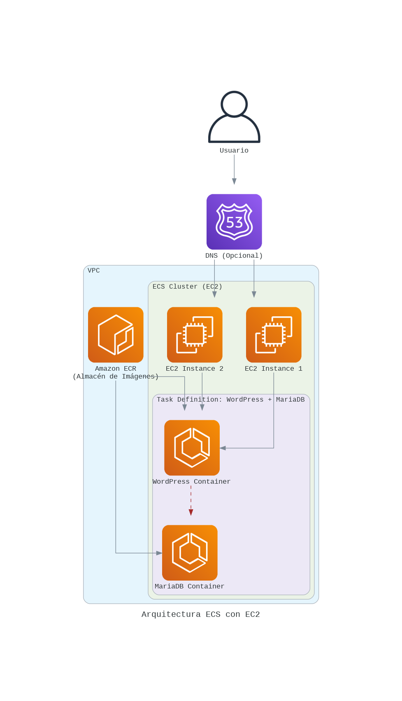
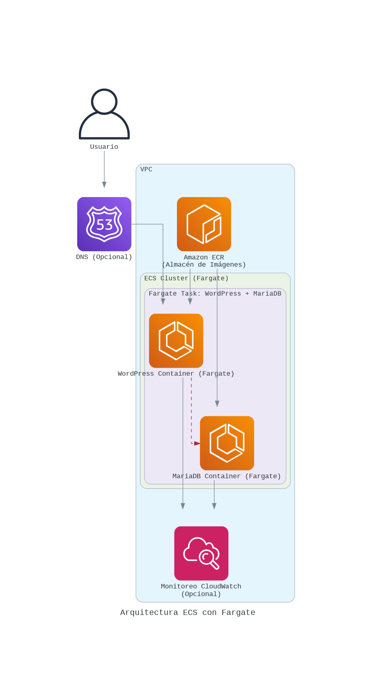

# 40984 - Computación en la Nube 🌥️

¡Bienvenido a mi repositorio de prácticas para la asignatura de **Computación en la Nube**! 🌐 Aquí encontrarás mis trabajos y proyectos desarrollados durante el curso.

---

## 📚 Índice de Prácticas

- [40984 - Computación en la Nube 🌥️](#40984---computación-en-la-nube-️)
  - [📚 Índice de Prácticas](#-índice-de-prácticas)
  - [1. 🚀 Despliegue Básico](#1--despliegue-básico)
    - [🔹 Actividades Principales](#-actividades-principales)
    - [💻 Ejemplo de Conexión SSH](#-ejemplo-de-conexión-ssh)
  - [2. ⚖️ Base de Datos, Balanceo y Escalado](#2-️-base-de-datos-balanceo-y-escalado)
    - [🔹 Actividades Principales](#-actividades-principales-1)
    - [💻 Comandos de Ejemplo](#-comandos-de-ejemplo)
    - [📊 Diagrama de la Infraestructura](#-diagrama-de-la-infraestructura)
  - [3. 📝 CloudFormation para Arquitectura en la Nube](#3--cloudformation-para-arquitectura-en-la-nube)
    - [🔹 Actividades Principales](#-actividades-principales-2)
    - [💻 Ejemplo de Conexiones y Comandos](#-ejemplo-de-conexiones-y-comandos)
    - [📊 Diagrama de la Arquitectura](#-diagrama-de-la-arquitectura)
    - [💡 Conclusiones](#-conclusiones)
  - [4. 🐳 Contenedores](#4--contenedores)
    - [🔹 Actividades Principales](#-actividades-principales-3)
    - [💻 Ejemplo de Comandos](#-ejemplo-de-comandos)
    - [📊 Diagrama de la Arquitectura (EC2)](#-diagrama-de-la-arquitectura-ec2)
    - [📊 Diagrama de la Arquitectura (Fargate)](#-diagrama-de-la-arquitectura-fargate)
    - [💡 Conclusiones](#-conclusiones-1)
  - [5. 🔄 Desacoplamiento con Colas y Eventos](#5--desacoplamiento-con-colas-y-eventos)
    - [🔹 Actividades Principales](#-actividades-principales-4)
    - [💻 Ejemplo de Flujo de Ejecución](#-ejemplo-de-flujo-de-ejecución)
    - [📊 Diagrama de la Arquitectura](#-diagrama-de-la-arquitectura-1)
    - [💡 Conclusiones](#-conclusiones-2)
  - [🌟 Recursos Adicionales](#-recursos-adicionales)
  - [✉️ Contacto](#️-contacto)

---

## 1. 🚀 Despliegue Básico

**Manual de actividad práctica 1: Despliegue Básico de Instancias EC2**

En esta práctica, exploramos los fundamentos del servicio EC2 de Amazon Web Services (AWS) mediante el despliegue de instancias en la nube. Utilizamos las instancias EC2 para realizar configuraciones básicas y establecer conexiones seguras SSH, además de configurar un servidor web y analizar los costos asociados.

[](https://aws.amazon.com/ec2/)

### 🔹 Actividades Principales

1. **Despliegue de una instancia SSH_gate:**

   - Configuración de una instancia EC2 como puerta de enlace para conexiones SSH.
   - Seguridad de la instancia mediante grupos de seguridad que limitan el acceso al puerto 22.

2. **Despliegue de un servidor web:**

   - Instalación y configuración de un servidor web en una segunda instancia EC2, accesible solo desde SSH_gate.
   - Publicación de una página con información personalizada.

3. **Análisis de costos:**

   - Evaluación de los costos estimados para el despliegue y mantenimiento de ambas instancias EC2.
   - Proyección de costos mensuales y anuales.

4. **Configuración de alertas en CloudWatch:**
   - Monitoreo de los gastos a través de CloudWatch y configuración de alertas para controlar el presupuesto de uso en AWS.

### 💻 Ejemplo de Conexión SSH

A continuación, se muestra el comando para establecer conexión SSH con la instancia `SSH_gate`:

```bash
ssh -i "~/.ssh/vockey.pem" ec2-user@ec2-54-87-55-252.compute-1.amazonaws.com
```

Para conectarse desde `SSH_gate` al servidor web:

```bash
ssh -i "~/.ssh/SSH_Gate.pem" ec2-user@ec2-18-206-188-39.compute-1.amazonaws.com
```

Esta práctica proporciona una base sólida para gestionar instancias y servicios en AWS, creando una comprensión práctica del entorno EC2 y sus herramientas de monitoreo y control de costos.

---

## 2. ⚖️ Base de Datos, Balanceo y Escalado

**Manual de actividad práctica 2: Base de Datos, Balanceo y Escalado**

En esta práctica, se implementó una infraestructura web escalable y altamente disponible en AWS, integrando bases de datos, balanceo de carga, y escalado automático. La experiencia permitió explorar los servicios de Amazon RDS, EC2, Load Balancers, y Auto Scaling Groups, profundizando en el despliegue y administración de recursos en la nube.

[](https://aws.amazon.com/elasticloadbalancing/)

### 🔹 Actividades Principales

1. **Configuración de instancias EC2:**
   - Despliegue de servidores web independientes en instancias EC2 con balanceo de carga y configurados con Nginx y Node.js.
2. **Balanceo de carga con Application Load Balancer (ALB):**

   - Configuración de un balanceador de carga que distribuye el tráfico de forma equitativa entre los servidores web.

3. **Escalado automático con Auto Scaling Group (ASG):**

   - Creación de un grupo de autoescalado para ajustar dinámicamente el número de instancias EC2 según la demanda.

4. **Despliegue de base de datos relacional (RDS):**

   - Configuración de una base de datos MySQL en Amazon RDS accesible desde las instancias EC2 y optimizada para la infraestructura desplegada.

5. **Estimación de costos:**
   - Análisis de costos asociados con el uso de EC2, balanceadores de carga, autoescalado y bases de datos, con proyecciones mensuales y anuales.

### 💻 Comandos de Ejemplo

A continuación, se muestra el comando para verificar la conexión con el balanceador de carga:

```bash
curl lb-pr2-p2-1198883516.us-east-1.elb.amazonaws.com
```

Comando para acceder a la base de datos MySQL desde la línea de comandos:

```bash
mysql -h pr2-p2-db.cntejlvl3d16.us-east-1.rds.amazonaws.com -u admin -p
```

### 📊 Diagrama de la Infraestructura


Esta práctica ha permitido profundizar en la creación y gestión de arquitecturas escalables en la nube, así como en la administración de recursos AWS para optimizar la disponibilidad y el rendimiento de los servicios.

---

## 3. 📝 CloudFormation para Arquitectura en la Nube

**Manual de actividad práctica 3: CloudFormation para Arquitectura en la Nube**

En esta práctica, exploramos el uso de **AWS CloudFormation** para definir y desplegar arquitecturas de nube de forma automatizada y reproducible. Utilizando plantillas en YAML, se configuraron recursos fundamentales de AWS, como instancias EC2, balanceadores de carga, y grupos de autoescalado (ASG), proporcionando una base para arquitecturas escalables y seguras.

[](https://aws.amazon.com/cloudformation/)

### 🔹 Actividades Principales

1. **Despliegue básico de EC2 con SSH y servidor web:**

   - **Objetivo**: Crear una instancia EC2 accesible mediante SSH y HTTP, que muestre un identificador único (UUID) generado en cada despliegue.
   - **Implementación**:
     - Creación de una plantilla en YAML que define la instancia EC2, los grupos de seguridad necesarios, y un script de inicialización para configurar Apache y generar la página web con el UUID.
     - **Pruebas de conexión**: Acceso a la instancia a través de SSH y HTTP para verificar la accesibilidad y el contenido de la página.

2. **Despliegue de infraestructura escalable con Balanceador de Carga y Auto Scaling:**

   - **Objetivo**: Implementar un balanceador de carga (ALB) y un grupo de autoescalado para distribuir el tráfico entre múltiples instancias EC2, manteniendo la alta disponibilidad y escalabilidad.
   - **Implementación**:
     - Configuración de una VPC personalizada con subredes públicas, reglas de ruteo, e internet gateway para habilitar el acceso desde Internet.
     - Definición de un Launch Template y un Auto Scaling Group que permite ajustar dinámicamente el número de instancias según la demanda.
     - Creación de un Application Load Balancer (ALB) que distribuye el tráfico entrante entre las instancias EC2 del grupo de autoescalado.
     - **Pruebas de conexión**: Validación del balanceo de carga mediante `curl` para verificar que las solicitudes se distribuyen entre instancias diferentes.

3. **Análisis de Costos y Optimización:**
   - Se realizó una estimación de costos que incluyó el uso de instancias EC2, balanceadores de carga, y almacenamiento en EBS. Este análisis es esencial para entender y optimizar los gastos en infraestructura en la nube.

### 💻 Ejemplo de Conexiones y Comandos

Comando para acceder por SSH a la instancia EC2:

```bash
ssh -i "~/.ssh/vockey.pem" ec2-user@<EC2_PUBLIC_IP>
```

Prueba de acceso al balanceador de carga (ALB):

```bash
curl <ALB_DNS_NAME>
```

### 📊 Diagrama de la Arquitectura


### 💡 Conclusiones

Esta práctica demostró el poder de AWS CloudFormation para automatizar el despliegue de arquitecturas en la nube de manera eficiente y reproducible. La experiencia adquirida en la configuración de stacks complejos con balanceo de carga y autoescalado permitió consolidar el conocimiento en infraestructura escalable y optimización de costos. Además, se enfatizó la importancia de buenas prácticas de seguridad y planificación de recursos, esenciales para un uso eficiente de la nube.

AWS CloudFormation facilita la gestión de infraestructuras y es una herramienta clave para entornos de desarrollo y producción, donde la consistencia y la rapidez en el despliegue son prioritarias.

---

## 4. 🐳 Contenedores

**Manual de actividad práctica 4: Contenedores en AWS con ECS**

En esta práctica, exploramos el uso de contenedores en AWS utilizando **Amazon Elastic Container Service (ECS)**. El objetivo principal fue aprender a crear, desplegar y gestionar contenedores Docker en la nube, comparando dos enfoques: **ECS con instancias EC2** y **ECS con Fargate**.

[](https://aws.amazon.com/ecs/)

### 🔹 Actividades Principales

1.  **Creación de un contenedor Docker:**

    - Se utilizó una aplicación web sencilla (WordPress) junto con una base de datos MariaDB, empaquetadas en contenedores Docker.
    - Se creó un `docker-compose.yml` para definir y orquestar los contenedores localmente.

2.  **Creación de un repositorio en ECR:**

    - Se configuró un repositorio privado en **Amazon Elastic Container Registry (ECR)** para almacenar las imágenes Docker.
    - Se utilizó la AWS CLI para autenticarse en ECR y subir las imágenes de WordPress y MariaDB.

3.  **Despliegue en ECS con EC2:**

    - Se creó un clúster ECS utilizando instancias EC2, lo que proporciona un mayor control sobre la infraestructura subyacente.
    - Se definió una **Task Definition** que incluía ambos contenedores (WordPress y MariaDB), configurando el modo de red `bridge` para la comunicación entre ellos.
    - Se creó un **Servicio ECS** para mantener la ejecución continua de la tarea.
    - Se analizó la arquitectura resultante y se realizó una estimación de costos.

4.  **Despliegue en ECS con Fargate:**

    - Se creó un nuevo clúster ECS utilizando **Fargate**, un motor de cómputo serverless para contenedores.
    - Se creó una nueva **Task Definition** adaptada a Fargate, utilizando el modo de red `awsvpc`.
    - Se experimentaron **problemas de conectividad** entre los contenedores dentro de la misma tarea en Fargate. A pesar de la documentación de AWS, WordPress no pudo conectarse a MariaDB.
    - Se propusieron soluciones alternativas: dividir los contenedores en servicios separados o utilizar un servicio de base de datos gestionado (RDS).
    - Se compararon las diferencias entre EC2 y Fargate en términos de gestión, flexibilidad, escalabilidad, costo y simplicidad. Se analizó la arquitectura con Fargate y los costos asociados.

5.  **Actividad extra:** Despliegue de un cluster con varios contenedores.

### 💻 Ejemplo de Comandos

- Creación de un repositorio en ECR y subida de imágenes:
  ```bash
  aws ecr get-login-password --region us-east-1 | docker login --username AWS --password-stdin 491250998585.dkr.ecr.us-east-1.amazonaws.com
  docker tag wordpress:latest [491250998585.dkr.ecr.us-east-1.amazonaws.com/wordpress:latest](https://www.google.com/search?q=https://491250998585.dkr.ecr.us-east-1.amazonaws.com/wordpress:latest)
  docker push [491250998585.dkr.ecr.us-east-1.amazonaws.com/wordpress:latest](https://www.google.com/search?q=https://491250998585.dkr.ecr.us-east-1.amazonaws.com/wordpress:latest)
  ```
- Creación y ejecución local de contenedores con docker-compose:
  ```bash
   docker-compose up
  ```

### 📊 Diagrama de la Arquitectura (EC2)



### 📊 Diagrama de la Arquitectura (Fargate)



### 💡 Conclusiones

Esta práctica proporcionó una experiencia práctica en la gestión de contenedores en AWS con ECS. Se aprendió a:

- Empaquetar aplicaciones en contenedores Docker.
- Utilizar ECR para almacenar y gestionar imágenes Docker.
- Desplegar contenedores en ECS utilizando tanto instancias EC2 como Fargate.
- Comprender las diferencias clave entre los dos enfoques de despliegue.
- Identificar y solucionar problemas de conectividad en Fargate.

La práctica también resaltó la importancia de elegir el enfoque de despliegue adecuado según las necesidades del proyecto, considerando factores como la gestión de la infraestructura, la flexibilidad, la escalabilidad, el costo y la complejidad. Además, se puso de manifiesto la conveniencia de usar servicios administrados como RDS para simplificar la arquitectura.

---

## 5. 🔄 Desacoplamiento con Colas y Eventos

**Manual de actividad práctica 5: Desacoplamiento con Colas y Eventos en AWS**

En esta práctica, transformamos una aplicación monolítica en una arquitectura de microservicios desacoplada utilizando **Amazon SQS (Simple Queue Service)** y **Amazon SNS (Simple Notification Service)**. El objetivo fue mejorar la escalabilidad, la tolerancia a fallos y la modularidad de la aplicación.

[](https://aws.amazon.com/sqs/)

### 🔹 Actividades Principales

1.  **Implementación de la Aplicación Monolítica:**
    *   Se desarrolló una aplicación en Python con tres funciones (`fA`, `fB`, `fC`) que se ejecutaban secuencialmente.  Cada función simulaba un proceso con un retardo (`sleep`).
    *   Se desplegó la aplicación monolítica en una instancia EC2 utilizando una plantilla de CloudFormation.

2.  **Desacoplamiento en Microservicios:**
    *   Se dividió la aplicación monolítica en tres microservicios independientes (`fA`, `fB`, `fC`), cada uno responsable de una función específica.
    *   Se crearon dos colas SQS (`QueueAtoB` y `QueueBtoC`) para facilitar la comunicación asíncrona entre los microservicios.
    *   `fA` se configuró como un servicio web (Flask) que, al recibir una petición, enviaba un mensaje a `QueueAtoB`.
    *   `fB` y `fC` se configuraron como *workers* que realizaban *polling* de sus respectivas colas, procesaban los mensajes y enviaban el resultado a la siguiente cola (o mostraban el resultado final en el caso de `fC`).
    *   Se desplegaron los tres microservicios en instancias EC2 independientes, utilizando una plantilla de CloudFormation que también creaba las colas SQS. 

3.  **Integración con Amazon SNS:**
    *   Se creó un *topic* de SNS (`TopicAtoB`).
    *   Se configuró `fA` para suscribirse al *topic* SNS, de modo que la publicación de un mensaje en el *topic* desencadenara el flujo de procesamiento a través de los microservicios.  Esto añadió una capa de abstracción y permitió que otros servicios o eventos pudieran iniciar el proceso.
    *   Se modificó la plantilla de CloudFormation y el código de `fA` para soportar la suscripción y confirmación con SNS.

### 💻 Ejemplo de Flujo de Ejecución

1.  Se publica un mensaje en el *topic* SNS (o se envía una petición HTTP directamente a `fA`).
2.  `fA` recibe el mensaje, lo procesa (añade "A") y envía el resultado a `QueueAtoB`.
3.  `fB` recibe el mensaje de `QueueAtoB`, lo procesa (añade "B") y envía el resultado a `QueueBtoC`.
4.  `fC` recibe el mensaje de `QueueBtoC`, lo procesa (añade "C") y muestra el resultado final.

### 📊 Diagrama de la Arquitectura


### 💡 Conclusiones

Esta práctica demostró cómo el uso de SQS y SNS permite construir arquitecturas de microservicios desacopladas, escalables y resilientes en AWS.  Los principales beneficios obtenidos fueron:

*   **Modularidad:** Cada microservicio se pudo desarrollar, desplegar y escalar de forma independiente.
*   **Tolerancia a Fallos:** Si un microservicio fallaba, los demás podían seguir funcionando gracias a la comunicación asíncrona a través de las colas.
*   **Escalabilidad:** Cada microservicio se puede escalar horizontalmente según sus necesidades, sin afectar a los demás.
*   **Flexibilidad:** Se puede integrar fácilmente con otros servicios y eventos a través de SNS.

La decisión de utilizar EC2 para el despliegue, en lugar de funciones Lambda, se basó en la necesidad de tener un mayor control sobre el entorno de ejecución y en la naturaleza continua del procesamiento de `fB` y `fC` (que realizan *polling* constante). Para escenarios con cargas de trabajo más variables o intermitentes, Lambda podría ser una alternativa más económica. Se realizó un análisis de costos que tuvo en cuenta el uso de instancias EC2, colas SQS, SNS y la transferencia de datos.

Se aprendió a utilizar SQS y SNS de forma efectiva, a configurar suscripciones HTTP a topics SNS, y a gestionar la confirmación de suscripciones. La experiencia adquirida es directamente aplicable al diseño y desarrollo de aplicaciones en la nube modernas y escalables.

---

## 🌟 Recursos Adicionales

- [Ejemplos de código AWS](https://github.com/awsdocs/aws-doc-sdk-examples)
- [Documentación Oficial de AWS](https://aws.amazon.com/documentation/)

---

## ✉️ Contacto

Si tienes alguna pregunta o sugerencia, no dudes en contactarme:

[](https://www.linkedin.com/in/frandu4/)

---
