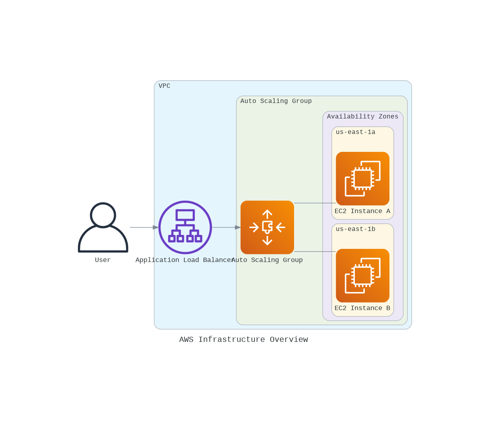

# 40984 - Computación en la Nube 🌥️ 

¡Bienvenido a mi repositorio de prácticas para la asignatura de **Computación en la Nube**! 🌐 Aquí encontrarás mis trabajos y proyectos desarrollados durante el curso.

---

## 📚 Índice de Prácticas

- [40984 - Computación en la Nube 🌥️](#40984---computación-en-la-nube-️)
  - [📚 Índice de Prácticas](#-índice-de-prácticas)
  - [1. 🚀 Despliegue Básico](#1--despliegue-básico)
    - [🔹 Actividades Principales](#-actividades-principales)
    - [💻 Ejemplo de Conexión SSH](#-ejemplo-de-conexión-ssh)
  - [2. ⚖️ Base de Datos, Balanceo y Escalado](#2-️-base-de-datos-balanceo-y-escalado)
    - [🔹 Actividades Principales](#-actividades-principales-1)
    - [💻 Comandos de Ejemplo](#-comandos-de-ejemplo)
    - [📊 Diagrama de la Infraestructura](#-diagrama-de-la-infraestructura)
  - [3. 📝 CloudFormation para Arquitectura en la Nube](#3--cloudformation-para-arquitectura-en-la-nube)
    - [🔹 Actividades Principales](#-actividades-principales-2)
    - [💻 Ejemplo de Conexiones y Comandos](#-ejemplo-de-conexiones-y-comandos)
    - [📊 Diagrama de la Arquitectura](#-diagrama-de-la-arquitectura)
    - [💡 Conclusiones](#-conclusiones)
  - [4. 🐳 Contenedores](#4--contenedores)
  - [5. 🔄 Desacoplamiento](#5--desacoplamiento)
  - [🌟 Recursos Adicionales](#-recursos-adicionales)
  - [✉️ Contacto](#️-contacto)

---

## 1. 🚀 Despliegue Básico

**Manual de actividad práctica 1: Despliegue Básico de Instancias EC2**

En esta práctica, exploramos los fundamentos del servicio EC2 de Amazon Web Services (AWS) mediante el despliegue de instancias en la nube. Utilizamos las instancias EC2 para realizar configuraciones básicas y establecer conexiones seguras SSH, además de configurar un servidor web y analizar los costos asociados.

[](https://aws.amazon.com/ec2/)

### 🔹 Actividades Principales

1. **Despliegue de una instancia SSH\_gate:** 
   - Configuración de una instancia EC2 como puerta de enlace para conexiones SSH.
   - Seguridad de la instancia mediante grupos de seguridad que limitan el acceso al puerto 22.

2. **Despliegue de un servidor web:** 
   - Instalación y configuración de un servidor web en una segunda instancia EC2, accesible solo desde SSH\_gate.
   - Publicación de una página con información personalizada.

3. **Análisis de costos:** 
   - Evaluación de los costos estimados para el despliegue y mantenimiento de ambas instancias EC2.
   - Proyección de costos mensuales y anuales.

4. **Configuración de alertas en CloudWatch:** 
   - Monitoreo de los gastos a través de CloudWatch y configuración de alertas para controlar el presupuesto de uso en AWS.

### 💻 Ejemplo de Conexión SSH

A continuación, se muestra el comando para establecer conexión SSH con la instancia `SSH_gate`:

```bash
ssh -i "~/.ssh/vockey.pem" ec2-user@ec2-54-87-55-252.compute-1.amazonaws.com
```

Para conectarse desde `SSH_gate` al servidor web:

```bash
ssh -i "~/.ssh/SSH_Gate.pem" ec2-user@ec2-18-206-188-39.compute-1.amazonaws.com
```

Esta práctica proporciona una base sólida para gestionar instancias y servicios en AWS, creando una comprensión práctica del entorno EC2 y sus herramientas de monitoreo y control de costos.

---

## 2. ⚖️ Base de Datos, Balanceo y Escalado

**Manual de actividad práctica 2: Base de Datos, Balanceo y Escalado**

En esta práctica, se implementó una infraestructura web escalable y altamente disponible en AWS, integrando bases de datos, balanceo de carga, y escalado automático. La experiencia permitió explorar los servicios de Amazon RDS, EC2, Load Balancers, y Auto Scaling Groups, profundizando en el despliegue y administración de recursos en la nube.

[](https://aws.amazon.com/elasticloadbalancing/)

### 🔹 Actividades Principales

1. **Configuración de instancias EC2:** 
   - Despliegue de servidores web independientes en instancias EC2 con balanceo de carga y configurados con Nginx y Node.js.
   
2. **Balanceo de carga con Application Load Balancer (ALB):**
   - Configuración de un balanceador de carga que distribuye el tráfico de forma equitativa entre los servidores web.

3. **Escalado automático con Auto Scaling Group (ASG):**
   - Creación de un grupo de autoescalado para ajustar dinámicamente el número de instancias EC2 según la demanda.

4. **Despliegue de base de datos relacional (RDS):**
   - Configuración de una base de datos MySQL en Amazon RDS accesible desde las instancias EC2 y optimizada para la infraestructura desplegada.

5. **Estimación de costos:** 
   - Análisis de costos asociados con el uso de EC2, balanceadores de carga, autoescalado y bases de datos, con proyecciones mensuales y anuales.

### 💻 Comandos de Ejemplo

A continuación, se muestra el comando para verificar la conexión con el balanceador de carga:

```bash
curl lb-pr2-p2-1198883516.us-east-1.elb.amazonaws.com
```

Comando para acceder a la base de datos MySQL desde la línea de comandos:

```bash
mysql -h pr2-p2-db.cntejlvl3d16.us-east-1.rds.amazonaws.com -u admin -p
```

### 📊 Diagrama de la Infraestructura



Esta práctica ha permitido profundizar en la creación y gestión de arquitecturas escalables en la nube, así como en la administración de recursos AWS para optimizar la disponibilidad y el rendimiento de los servicios.

---

## 3. 📝 CloudFormation para Arquitectura en la Nube

**Manual de actividad práctica 3: CloudFormation para Arquitectura en la Nube**

En esta práctica, exploramos el uso de **AWS CloudFormation** para definir y desplegar arquitecturas de nube de forma automatizada y reproducible. Utilizando plantillas en YAML, se configuraron recursos fundamentales de AWS, como instancias EC2, balanceadores de carga, y grupos de autoescalado (ASG), proporcionando una base para arquitecturas escalables y seguras.

[](https://aws.amazon.com/cloudformation/)

### 🔹 Actividades Principales

1. **Despliegue básico de EC2 con SSH y servidor web:**
   - **Objetivo**: Crear una instancia EC2 accesible mediante SSH y HTTP, que muestre un identificador único (UUID) generado en cada despliegue.
   - **Implementación**: 
     - Creación de una plantilla en YAML que define la instancia EC2, los grupos de seguridad necesarios, y un script de inicialización para configurar Apache y generar la página web con el UUID.
     - **Pruebas de conexión**: Acceso a la instancia a través de SSH y HTTP para verificar la accesibilidad y el contenido de la página.

2. **Despliegue de infraestructura escalable con Balanceador de Carga y Auto Scaling:**
   - **Objetivo**: Implementar un balanceador de carga (ALB) y un grupo de autoescalado para distribuir el tráfico entre múltiples instancias EC2, manteniendo la alta disponibilidad y escalabilidad.
   - **Implementación**:
     - Configuración de una VPC personalizada con subredes públicas, reglas de ruteo, e internet gateway para habilitar el acceso desde Internet.
     - Definición de un Launch Template y un Auto Scaling Group que permite ajustar dinámicamente el número de instancias según la demanda.
     - Creación de un Application Load Balancer (ALB) que distribuye el tráfico entrante entre las instancias EC2 del grupo de autoescalado.
     - **Pruebas de conexión**: Validación del balanceo de carga mediante `curl` para verificar que las solicitudes se distribuyen entre instancias diferentes.

3. **Análisis de Costos y Optimización:**
   - Se realizó una estimación de costos que incluyó el uso de instancias EC2, balanceadores de carga, y almacenamiento en EBS. Este análisis es esencial para entender y optimizar los gastos en infraestructura en la nube.

### 💻 Ejemplo de Conexiones y Comandos

Comando para acceder por SSH a la instancia EC2:

```bash
ssh -i "~/.ssh/vockey.pem" ec2-user@<EC2_PUBLIC_IP>
```

Prueba de acceso al balanceador de carga (ALB):

```bash
curl <ALB_DNS_NAME>
```

### 📊 Diagrama de la Arquitectura


### 💡 Conclusiones

Esta práctica demostró el poder de AWS CloudFormation para automatizar el despliegue de arquitecturas en la nube de manera eficiente y reproducible. La experiencia adquirida en la configuración de stacks complejos con balanceo de carga y autoescalado permitió consolidar el conocimiento en infraestructura escalable y optimización de costos. Además, se enfatizó la importancia de buenas prácticas de seguridad y planificación de recursos, esenciales para un uso eficiente de la nube.

AWS CloudFormation facilita la gestión de infraestructuras y es una herramienta clave para entornos de desarrollo y producción, donde la consistencia y la rapidez en el despliegue son prioritarias.

---

## 4. 🐳 Contenedores

**Manual de actividad práctica 4: Contenedores**

El objetivo de esta práctica es aprender a utilizar contenedores en AWS usando los servicios de ECS. Se recomienda revisar la documentación:

- 📄 [Amazon ECS Developer Guide](https://docs.aws.amazon.com/AmazonECS/latest/developerguide/Welcome.html)

[](https://aws.amazon.com/ecs/)

*Aquí agregaré más información próximamente...*

---

## 5. 🔄 Desacoplamiento

**Manual de actividad práctica 5: Desacoplamiento**

El objetivo de esta práctica es experimentar con los servicios de colas y eventos de AWS para desacoplar una aplicación monolítica en un conjunto de microservicios escalable.

[](https://aws.amazon.com/sqs/)

*Aquí agregaré más información próximamente...*

---

## 🌟 Recursos Adicionales

- [Ejemplos de código AWS](https://github.com/awsdocs/aws-doc-sdk-examples)
- [Documentación Oficial de AWS](https://aws.amazon.com/documentation/)

---

## ✉️ Contacto

Si tienes alguna pregunta o sugerencia, no dudes en contactarme:

[](https://www.linkedin.com/in/frandu4/)

---
